# Architecture and Workflow

## System Overview

This document describes the technical architecture and data flow for the Bullhorn AI Candidate Ranking integration. The system connects Bullhorn CRM to an AI evaluation engine to automate candidate ranking.

**Core Principle:** Bullhorn is the single source of truth. All data originates from and returns to Bullhorn.

---

## High-Level System Context

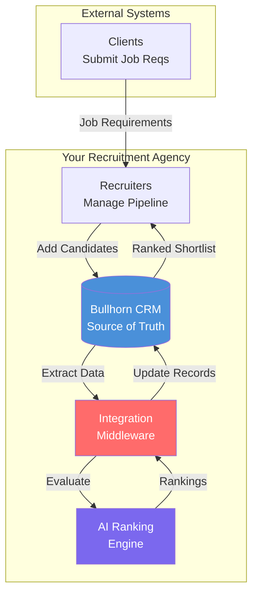

---

## Component Architecture

### System Components

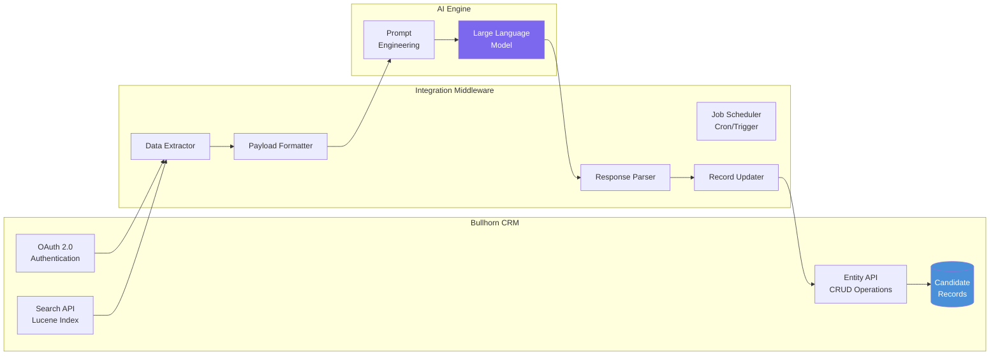

### Component Responsibilities

| Component | Responsibility | Technology |
|-----------|---------------|------------|
| **Bullhorn OAuth 2.0** | Authenticate and obtain session token | REST API, OAuth 2.0 |
| **Bullhorn Search API** | Query candidates using Lucene syntax | REST API, Lucene |
| **Bullhorn Entity API** | Update candidate records with rankings | REST API, JSON |
| **Job Scheduler** | Trigger integration at scheduled intervals | Cron, AWS EventBridge, etc. |
| **Data Extractor** | Pull candidate data from Bullhorn | Python/Node.js |
| **Payload Formatter** | Structure data for LLM consumption | JSON processing |
| **AI Engine** | Evaluate and rank candidates | LLM (OpenAI, Claude, Gemini) |
| **Response Parser** | Extract rankings from LLM response | JSON parsing |
| **Record Updater** | Write rankings back to Bullhorn | REST API calls |

---

## Authentication Flow

### Bullhorn OAuth 2.0 Login Sequence

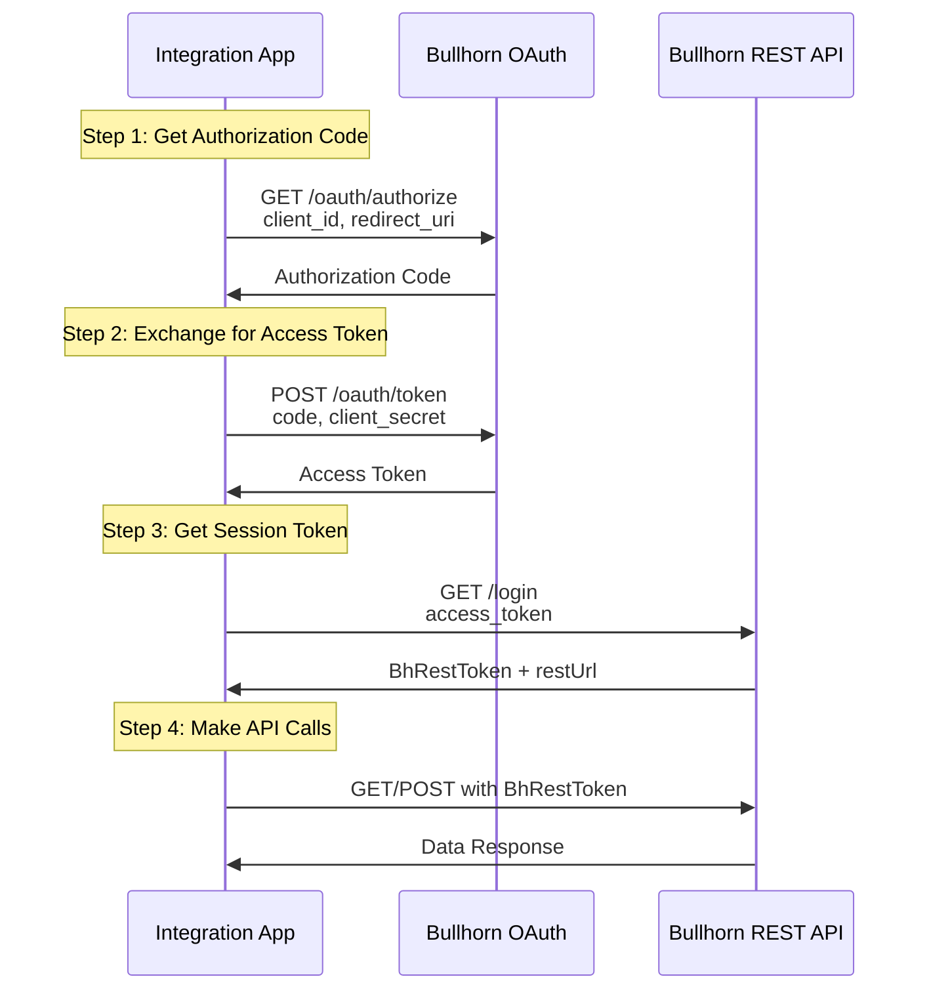

### Session Token Requirements

- **BhRestToken:** Must be included in all API requests
- **restUrl:** Data center-specific URL (varies by region)
- **Token Lifetime:** Typically 10 hours, implement refresh logic
- **Storage:** Store securely, never expose in logs

---

## Data Flow

### Complete Integration Workflow

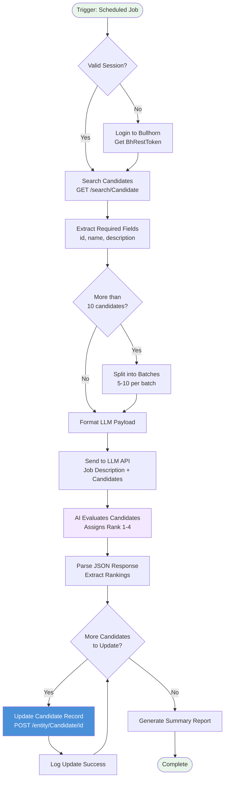

### Data Transformation Pipeline

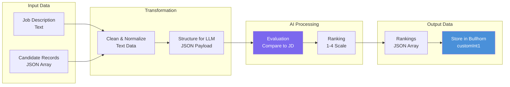

---

## Batch Processing Strategy

### Why Batch Processing?

LLMs have context window limits. Sending 50+ full resumes at once may:
- Exceed token limits
- Increase latency
- Reduce evaluation quality

### Recommended Batch Sizes

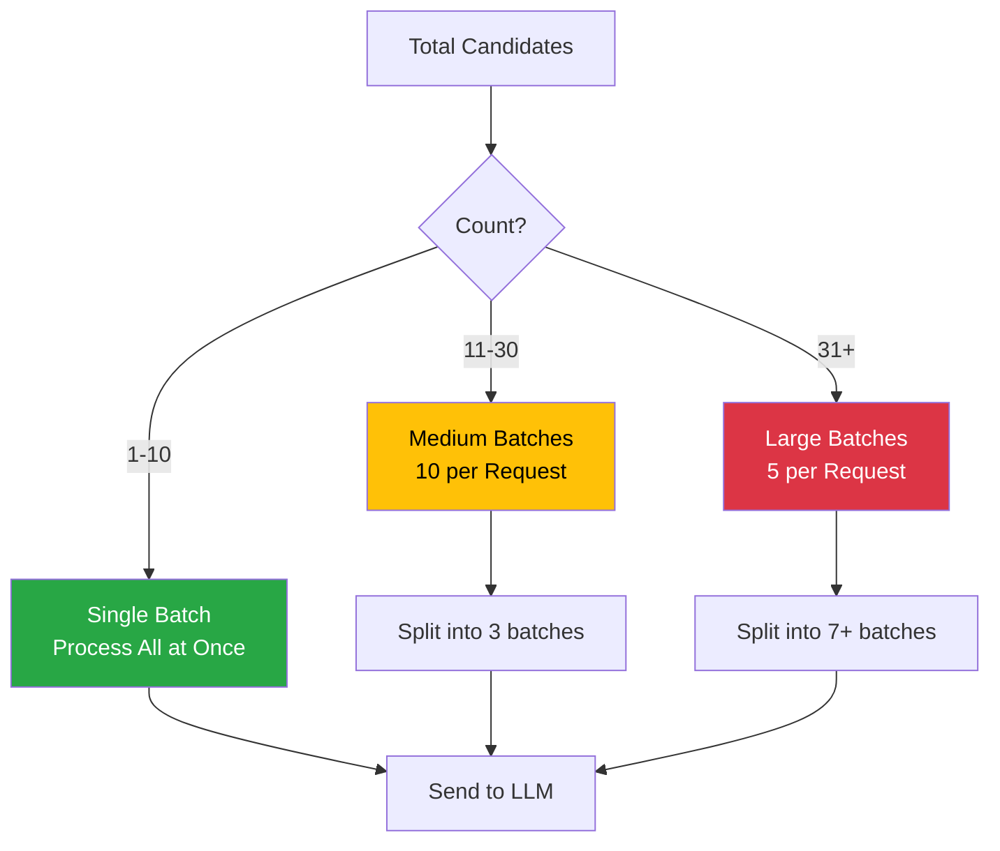

### Batch Processing Flow

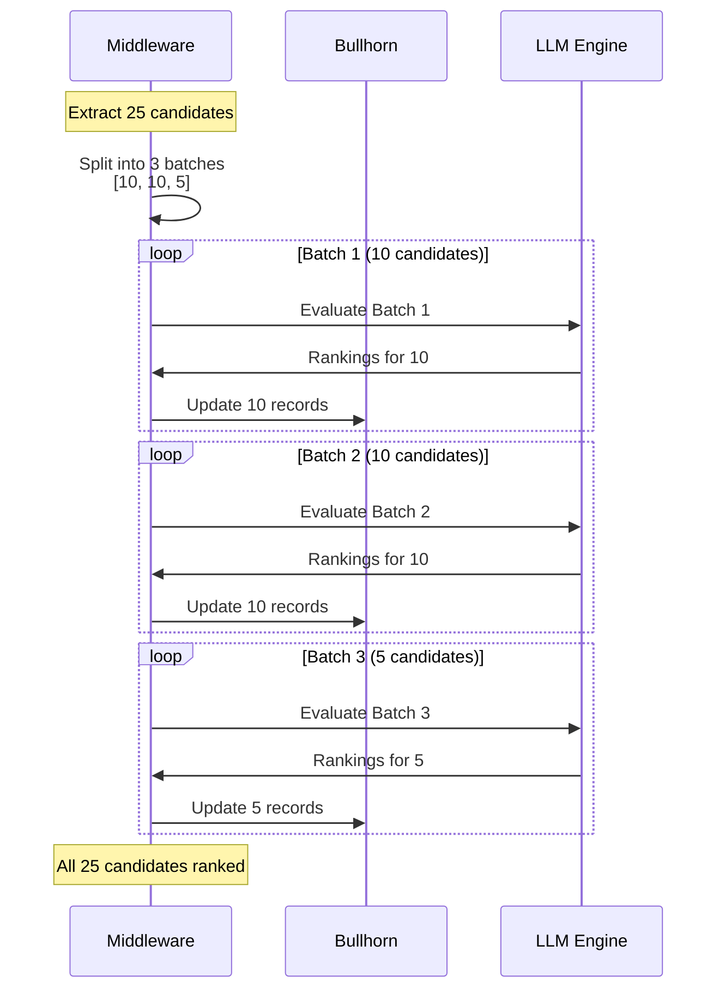

---

## Error Handling

### Error Handling Flow

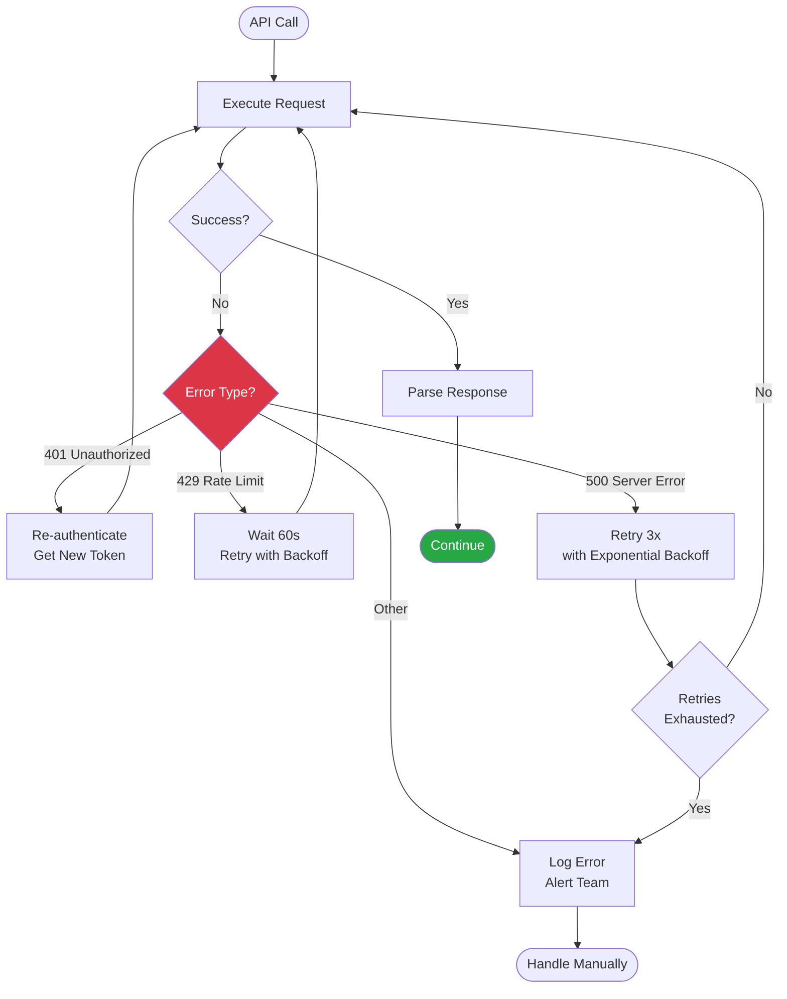

### Common Error Scenarios

| Error Code | Meaning | Recovery Action |
|------------|---------|-----------------|
| **401** | Session expired | Re-authenticate with OAuth 2.0 |
| **429** | Rate limit exceeded | Implement exponential backoff |
| **500** | Bullhorn server error | Retry with backoff, max 3 attempts |
| **400** | Bad request (invalid JSON) | Log and skip, fix payload structure |
| **404** | Candidate not found | Log and skip, candidate may be deleted |

---

## Security Architecture

### Security Layers

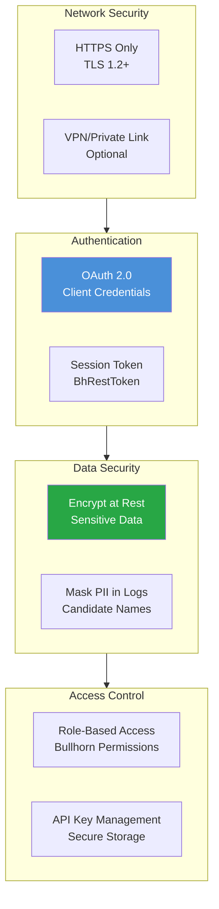

### Best Practices

1. **Never log credentials or session tokens**
2. **Store API keys in environment variables or secret managers**
3. **Use HTTPS for all API communications**
4. **Implement token refresh before expiration**
5. **Mask candidate PII in application logs**
6. **Follow Bullhorn API rate limits (check documentation)**

---

## Deployment Architecture

### Deployment Options

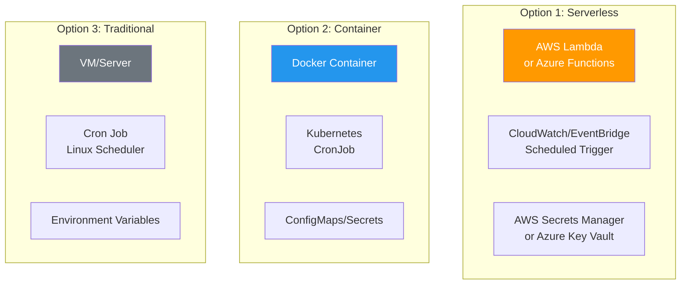

### Recommended: Serverless Architecture

**Benefits:**
- No server management
- Pay-per-execution
- Automatic scaling
- Built-in logging and monitoring

**Components:**
- **AWS Lambda** or **Azure Functions** for compute
- **CloudWatch Events** or **EventBridge** for scheduling
- **Secrets Manager** or **Key Vault** for credential storage
- **CloudWatch Logs** for monitoring and debugging

---

## Monitoring and Observability

### Monitoring Dashboard

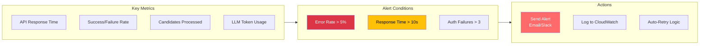

### Key Metrics to Track

| Metric | Target | Alert Threshold |
|--------|--------|-----------------|
| API Response Time | < 2 seconds | > 10 seconds |
| Success Rate | > 98% | < 95% |
| Candidates Processed/Hour | Varies | N/A |
| Authentication Failures | 0 | > 3 consecutive |
| LLM Token Usage | Track cost | Budget limit |

---

## Scalability Considerations

### Scaling Strategy

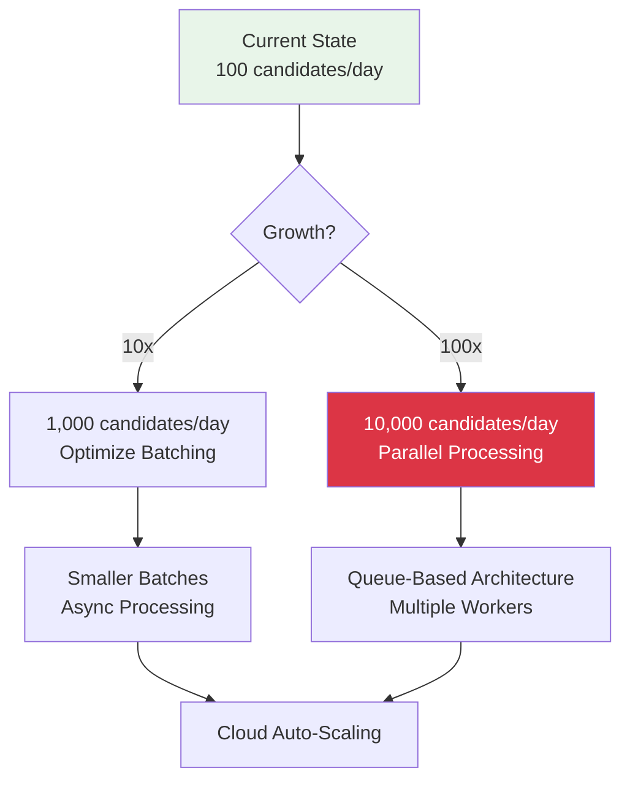

### Performance Optimization

1. **Parallel API calls** for independent operations
2. **Connection pooling** for HTTP clients
3. **Caching** for authentication tokens
4. **Asynchronous processing** for large batches
5. **Database optimization** for logging and audit trails

---

## Next Steps

1. Review **BULLHORN_IMPLEMENTATION_SPEC.md** for API details
2. Review **LLM_PROMPT_ENGINEERING.md** for prompt design
3. Set up development environment with API credentials
4. Implement authentication flow first
5. Test with small batch of candidates (5-10)
6. Monitor and optimize before production deployment

---

## Related Documentation

- **README.md** - Executive overview
- **BULLHORN_IMPLEMENTATION_SPEC.md** - API specifications
- **LLM_PROMPT_ENGINEERING.md** - Prompt design
- **FUTURE_STATE_FIELDGLASS_INTEGRATION.md** - Phase 2 roadmap
- **INTEGRATION_PROMPT.md** - Ready-to-use implementation
