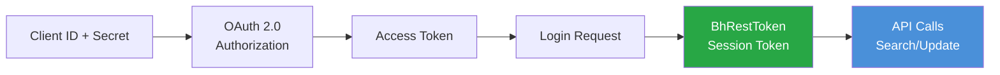
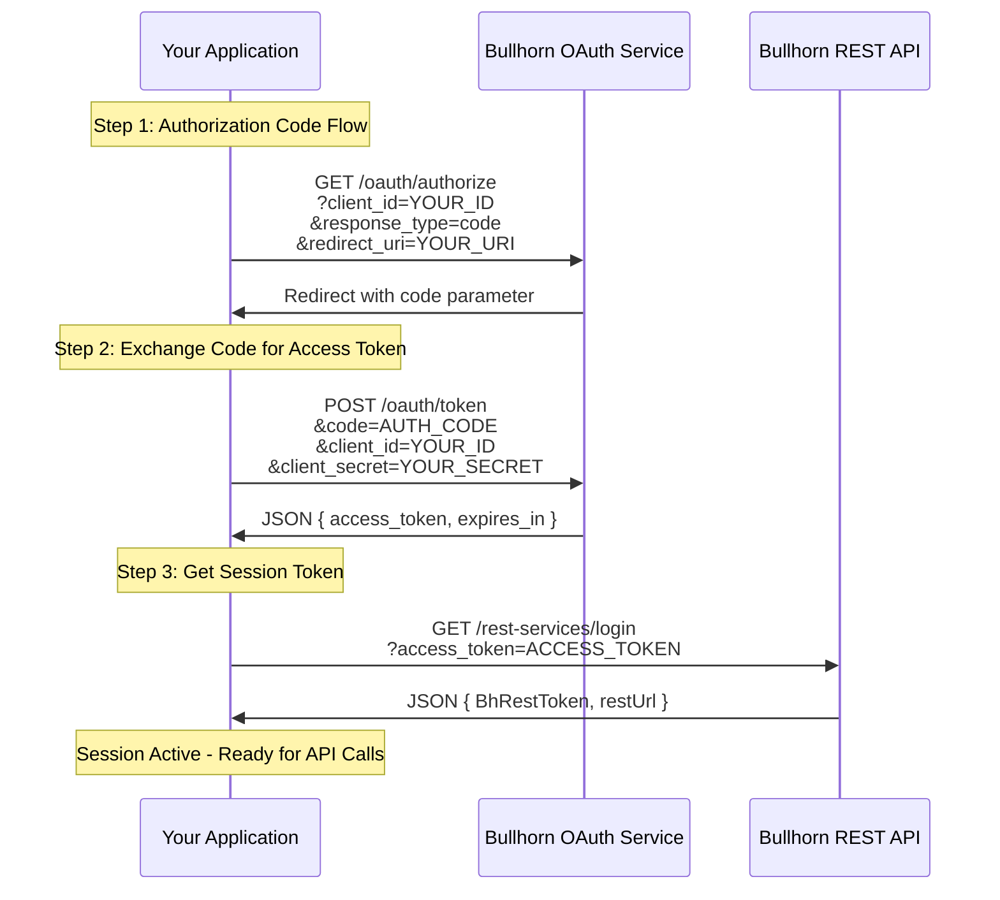
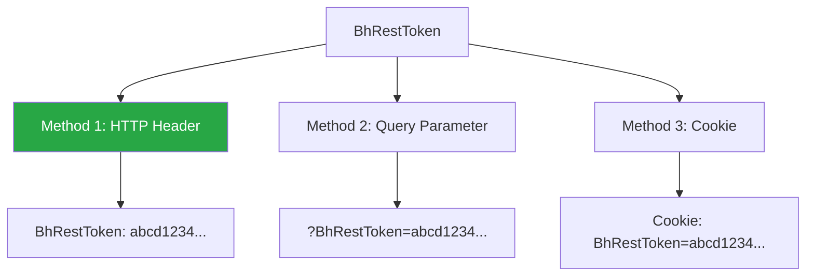
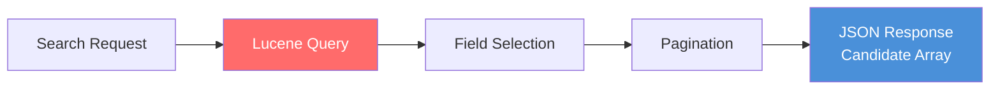
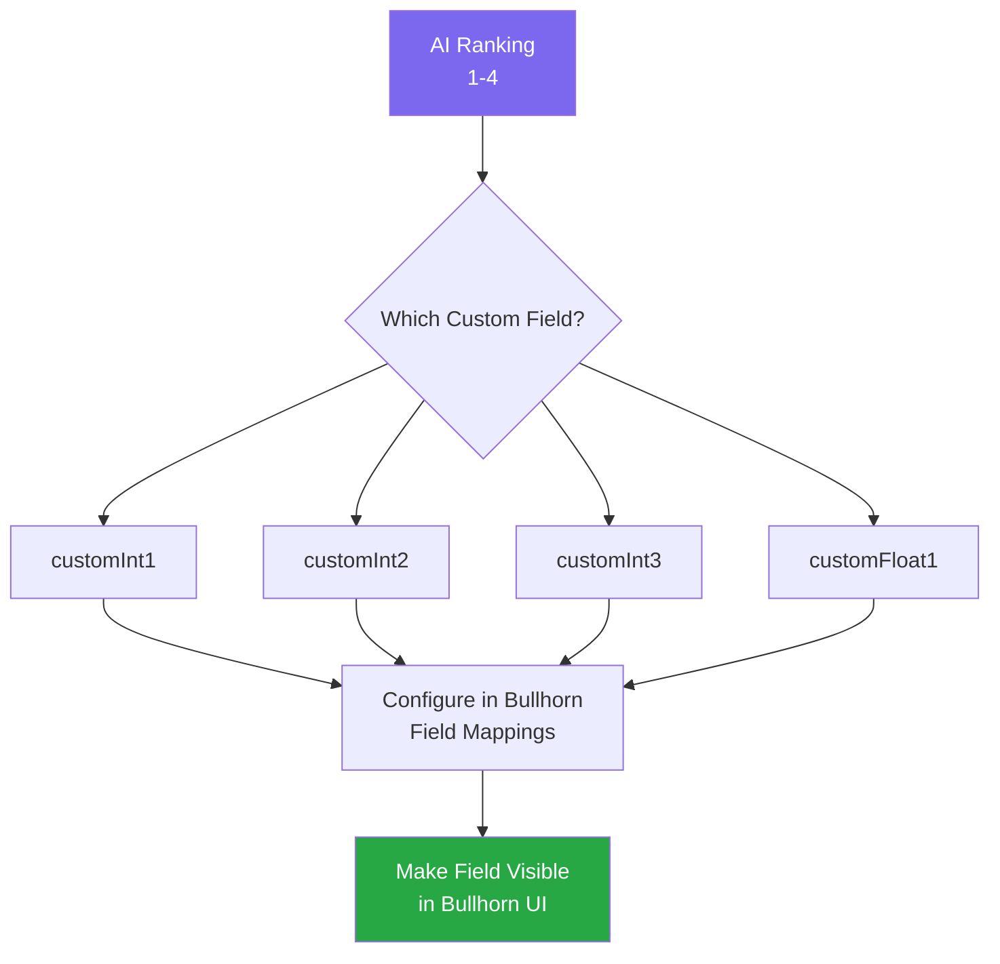
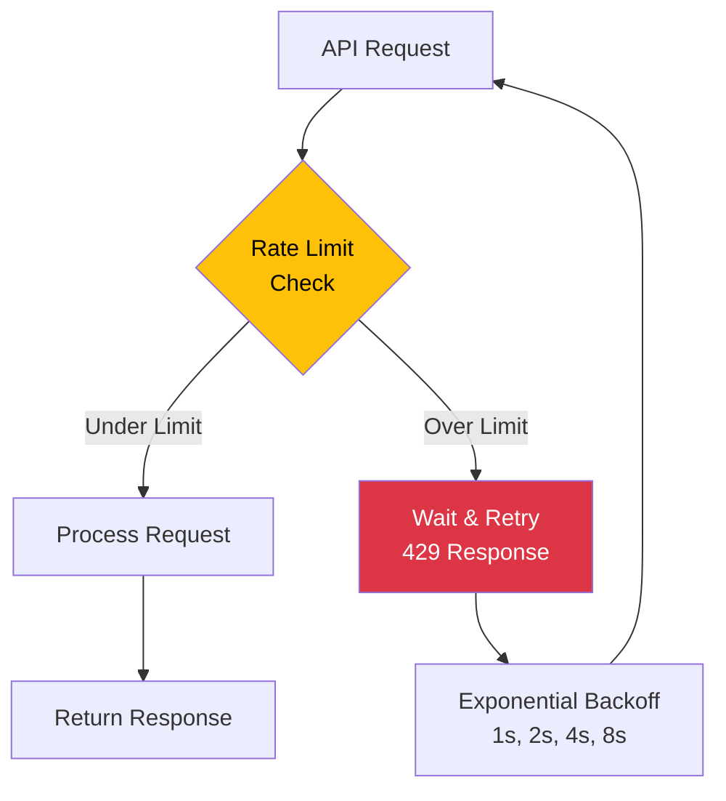
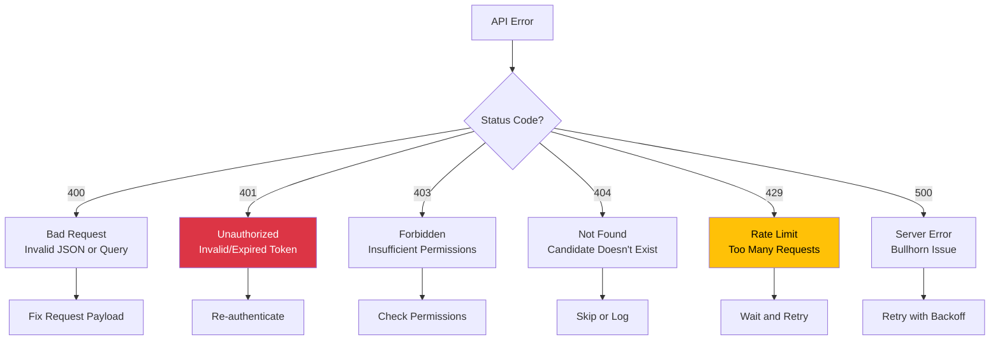

# Bullhorn Implementation Specification

## Overview

This document provides detailed technical specifications for integrating with the Bullhorn REST API to extract candidate data and update candidate rankings.

**API Documentation:** https://bullhorn.github.io/rest-api-docs/

---

## API Authentication

### Authentication Overview

All Bullhorn API requests require authentication via OAuth 2.0. The authentication flow provides a session token (`BhRestToken`) that must be included in all subsequent API calls.



---

## Authentication Flow

### Step-by-Step Authentication Process



### Login Endpoint

**Request:**
```http
GET https://auth.bullhornstaffing.com/oauth/authorize
  ?client_id={YOUR_CLIENT_ID}
  &response_type=code
  &redirect_uri={YOUR_REDIRECT_URI}
```

**Token Exchange:**
```http
POST https://auth.bullhornstaffing.com/oauth/token
Content-Type: application/x-www-form-urlencoded

code={AUTHORIZATION_CODE}
&client_id={YOUR_CLIENT_ID}
&client_secret={YOUR_CLIENT_SECRET}
&redirect_uri={YOUR_REDIRECT_URI}
&grant_type=authorization_code
```

**Session Login:**
```http
GET https://rest.bullhornstaffing.com/rest-services/login
  ?access_token={ACCESS_TOKEN}
```

**Response:**
```json
{
  "BhRestToken": "abcd1234-5678-90ef-ghij-klmnopqrstuv",
  "restUrl": "https://rest.bullhornstaffing.com/rest-services/e999/"
}
```

---

## Using the Session Token

### Token Inclusion Methods

The `BhRestToken` can be included in requests using one of three methods:



**Recommended:** Use HTTP Header for better security

```http
GET /rest-services/e999/search/Candidate
BhRestToken: abcd1234-5678-90ef-ghij-klmnopqrstuv
```

---

## Candidate Search API

### Search Endpoint Overview

The `/search/Candidate` endpoint queries the Bullhorn Lucene index to retrieve candidate records. This is highly performant for filtering and searching.



### Search Endpoint

**Endpoint:**
```http
GET {restUrl}/search/Candidate
```

**Required Parameters:**

| Parameter | Type | Description | Example |
|-----------|------|-------------|---------|
| `query` | string | Lucene search query | `status:"Active" AND isDeleted:0` |
| `fields` | string | Comma-separated field list | `id,firstName,lastName,description` |
| `count` | integer | Number of results (max 500) | `10` |

**Optional Parameters:**

| Parameter | Type | Description | Example |
|-----------|------|-------------|---------|
| `start` | integer | Pagination offset | `0` |
| `sort` | string | Sort field and direction | `-dateAdded` |

---

## Lucene Query Syntax

### Query Building Blocks

```mermaid
flowchart TD
    Query[Lucene Query] --> Field[Field Matches]
    Query --> Operators[Boolean Operators]
    Query --> Ranges[Range Queries]
    
    Field --> Example1[status:"Active"]
    Operators --> Example2[AND, OR, NOT]
    Ranges --> Example3[dateAdded:[2023-01-01 TO *]]
    
    style Example1 fill:#E8F4FD
    style Example2 fill:#E8F4FD
    style Example3 fill:#E8F4FD
```

### Common Query Examples

**Active candidates not deleted:**
```
status:"Active" AND isDeleted:0
```

**Candidates with specific skills:**
```
primarySkills:"Java" AND primarySkills:"AWS"
```

**Candidates added in last 30 days:**
```
dateAdded:[NOW-30DAYS TO *]
```

**Candidates in specific location:**
```
address.city:"London" AND status:"Active"
```

**Complex query with multiple criteria:**
```
status:"Active" AND isDeleted:0 AND (primarySkills:"Java" OR primarySkills:"Python")
```

---

## Search Request Example

### Full Search Request

```http
GET https://rest.bullhornstaffing.com/rest-services/e999/search/Candidate
  ?query=status:"Active" AND isDeleted:0
  &fields=id,firstName,lastName,description,primarySkills,email
  &count=10
  &sort=-dateAdded
BhRestToken: abcd1234-5678-90ef-ghij-klmnopqrstuv
```

### Search Response Structure

```json
{
  "total": 150,
  "start": 0,
  "count": 10,
  "data": [
    {
      "id": 5059165,
      "firstName": "Alanzo",
      "lastName": "Smith",
      "description": "Experienced Java developer with 6 years in AWS environments. Strong background in microservices architecture and CI/CD pipelines...",
      "primarySkills": [
        { "id": 1, "name": "Java" },
        { "id": 2, "name": "AWS" },
        { "id": 3, "name": "Docker" }
      ],
      "email": "alanzo.smith@email.com"
    },
    {
      "id": 5059166,
      "firstName": "Janis",
      "lastName": "Williams",
      "description": "Junior developer with 1 year of Python experience. Familiar with Django framework...",
      "primarySkills": [
        { "id": 4, "name": "Python" },
        { "id": 5, "name": "Django" }
      ],
      "email": "janis.williams@email.com"
    }
  ]
}
```

---

## Candidate Update API

### Update Endpoint Overview

The `/entity/Candidate/{id}` endpoint updates an existing candidate record. Use POST method to modify specific fields.


### Update Endpoint

**Endpoint:**
```http
POST {restUrl}/entity/Candidate/{candidateId}
Content-Type: application/json
BhRestToken: {session_token}
```

**Request Body:**
```json
{
  "customInt1": 2
}
```

**Success Response:**
```json
{
  "changedEntityId": 5059165,
  "changeType": "UPDATE"
}
```

---

## Custom Field Mapping

### Identifying the Ranking Field

You need to map the AI ranking (1-4) to a custom integer field in Bullhorn. Common options:



### Field Mapping Requirements

1. **Choose an unused custom integer field** (e.g., `customInt1`)
2. **Unhide the field** in Bullhorn Field Mappings
3. **Label the field appropriately** (e.g., "AI Ranking" or "Match Score")
4. **Set appropriate permissions** for recruiter visibility
5. **Test with a sample candidate** before bulk updates

### Checking Field Availability

**Request:**
```http
GET {restUrl}/entity/Candidate/5059165
  ?fields=customInt1,customInt2,customInt3
BhRestToken: {session_token}
```

**Response:**
```json
{
  "data": {
    "id": 5059165,
    "customInt1": null,
    "customInt2": null,
    "customInt3": null
  }
}
```

If the field returns `null` or is not present, it may be hidden or unavailable.

---

## Update Request Examples

### Single Candidate Update

```http
POST https://rest.bullhornstaffing.com/rest-services/e999/entity/Candidate/5059165
Content-Type: application/json
BhRestToken: abcd1234-5678-90ef-ghij-klmnopqrstuv

{
  "customInt1": 1
}
```

### Batch Update Loop (Pseudocode)

```python
# After receiving LLM rankings
rankings = [
    {"candidate_id": 5059165, "rank": 1},
    {"candidate_id": 5059166, "rank": 4},
    {"candidate_id": 5059167, "rank": 2}
]

for ranking in rankings:
    response = requests.post(
        f"{rest_url}/entity/Candidate/{ranking['candidate_id']}",
        headers={
            "BhRestToken": session_token,
            "Content-Type": "application/json"
        },
        json={"customInt1": ranking["rank"]}
    )
    
    if response.status_code == 200:
        print(f"Updated candidate {ranking['candidate_id']} with rank {ranking['rank']}")
    else:
        print(f"Failed to update candidate {ranking['candidate_id']}")
```

---

## Rate Limits and Pagination

### Rate Limiting



### Rate Limit Best Practices

- **Check Bullhorn API documentation** for current rate limits
- **Implement exponential backoff** for 429 responses
- **Batch requests efficiently** to minimize API calls
- **Cache authentication tokens** to reduce login calls
- **Monitor API usage** to stay within limits

### Pagination Strategy

For large result sets, use pagination:

```http
# First page
GET /search/Candidate?query=...&fields=...&start=0&count=100

# Second page
GET /search/Candidate?query=...&fields=...&start=100&count=100

# Third page
GET /search/Candidate?query=...&fields=...&start=200&count=100
```

---

## Error Handling

### Common Error Codes



### Error Response Structure

```json
{
  "errorMessage": "Invalid session token",
  "errorMessageKey": "errors.invalidSession",
  "errorCode": 401
}
```

### Error Handling Implementation

```python
import time
import requests

def update_candidate_with_retry(candidate_id, rank, max_retries=3):
    for attempt in range(max_retries):
        try:
            response = requests.post(
                f"{rest_url}/entity/Candidate/{candidate_id}",
                headers={
                    "BhRestToken": session_token,
                    "Content-Type": "application/json"
                },
                json={"customInt1": rank}
            )
            
            if response.status_code == 200:
                return response.json()
            elif response.status_code == 401:
                # Re-authenticate
                session_token = get_new_session_token()
            elif response.status_code == 429:
                # Rate limit - exponential backoff
                wait_time = (2 ** attempt)
                time.sleep(wait_time)
            else:
                # Log error and skip
                print(f"Error updating candidate {candidate_id}: {response.status_code}")
                return None
                
        except Exception as e:
            print(f"Exception on attempt {attempt + 1}: {e}")
            if attempt < max_retries - 1:
                time.sleep(2 ** attempt)
    
    return None
```

---

## Field Reference

### Candidate Entity Fields

| Field Name | Type | Description | Used For |
|------------|------|-------------|----------|
| `id` | integer | Unique candidate identifier | Primary key |
| `firstName` | string | Candidate first name | Display |
| `lastName` | string | Candidate last name | Display |
| `description` | string | Resume/summary text | AI evaluation |
| `primarySkills` | array | Skills objects | AI evaluation |
| `email` | string | Email address | Contact info |
| `status` | string | Candidate status | Filtering |
| `isDeleted` | boolean | Soft delete flag | Filtering |
| `customInt1` | integer | Custom integer field | AI ranking |
| `dateAdded` | timestamp | Record creation date | Sorting |

---

## Integration Checklist

### Pre-Implementation

- [ ] Bullhorn API credentials obtained (Client ID, Client Secret)
- [ ] Redirect URI configured in Bullhorn
- [ ] Custom field identified and unhidden (e.g., `customInt1`)
- [ ] Field permissions set for recruiter visibility
- [ ] Test environment access confirmed

### Implementation

- [ ] OAuth 2.0 authentication flow implemented
- [ ] Session token caching implemented
- [ ] Candidate search query tested
- [ ] Field extraction validated (id, name, description)
- [ ] Update endpoint tested with sample candidate
- [ ] Error handling implemented
- [ ] Retry logic with exponential backoff implemented

### Testing

- [ ] End-to-end flow tested with 5-10 candidates
- [ ] Ranking field updates verified in Bullhorn UI
- [ ] Error scenarios tested (invalid token, rate limits)
- [ ] Batch processing validated
- [ ] Performance benchmarked

### Deployment

- [ ] Production API credentials secured
- [ ] Logging and monitoring configured
- [ ] Alert thresholds set for failures
- [ ] Documentation shared with team
- [ ] Rollback plan documented

---

## Related Documentation

- **README.md** - Executive overview
- **ARCHITECTURE_AND_WORKFLOW.md** - System design
- **LLM_PROMPT_ENGINEERING.md** - Prompt design
- **FUTURE_STATE_FIELDGLASS_INTEGRATION.md** - Phase 2 roadmap
- **INTEGRATION_PROMPT.md** - Ready-to-use implementation

---

## API Reference Links

- **Bullhorn REST API Documentation:** https://bullhorn.github.io/rest-api-docs/
- **OAuth 2.0 Guide:** https://bullhorn.github.io/rest-api-docs/
- **Lucene Query Syntax:** https://lucene.apache.org/core/2_9_4/queryparsersyntax.html
