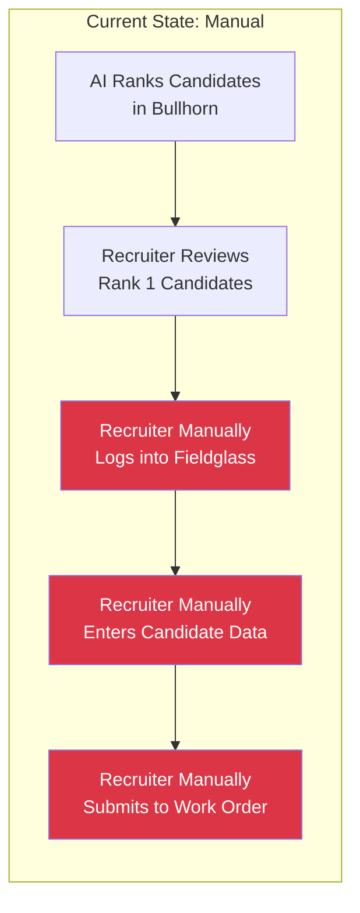
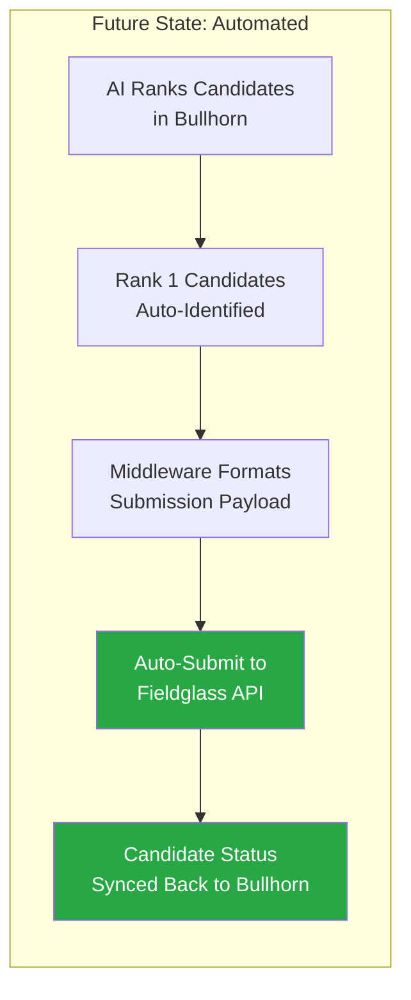
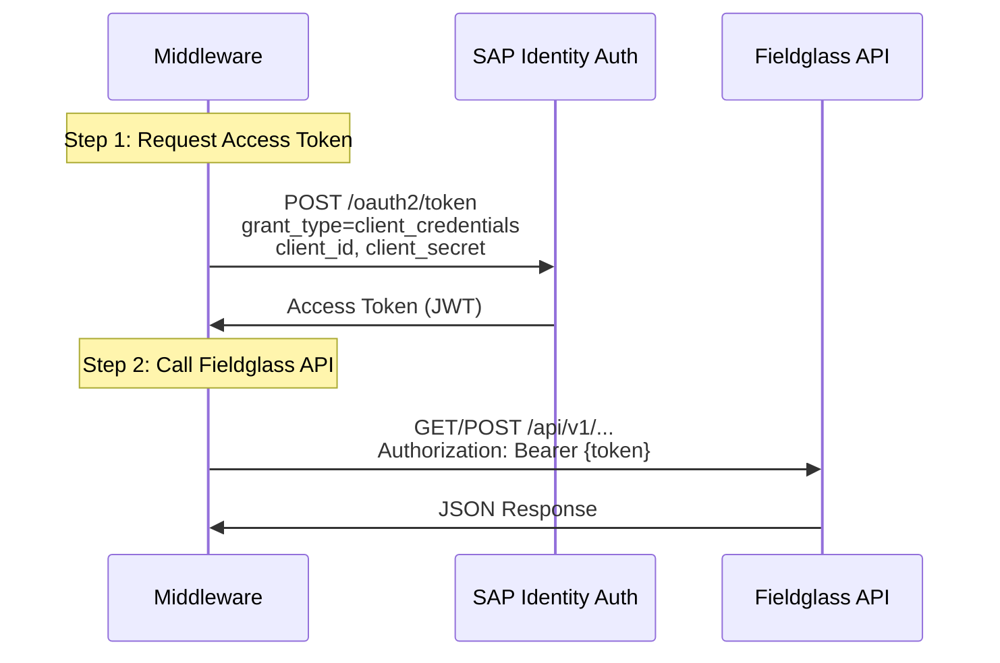
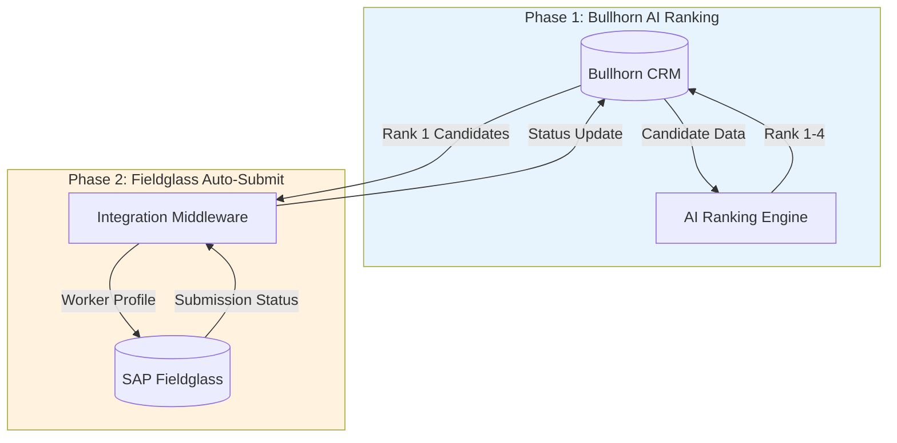
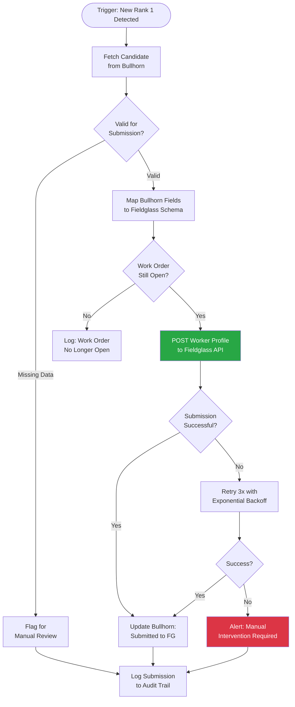
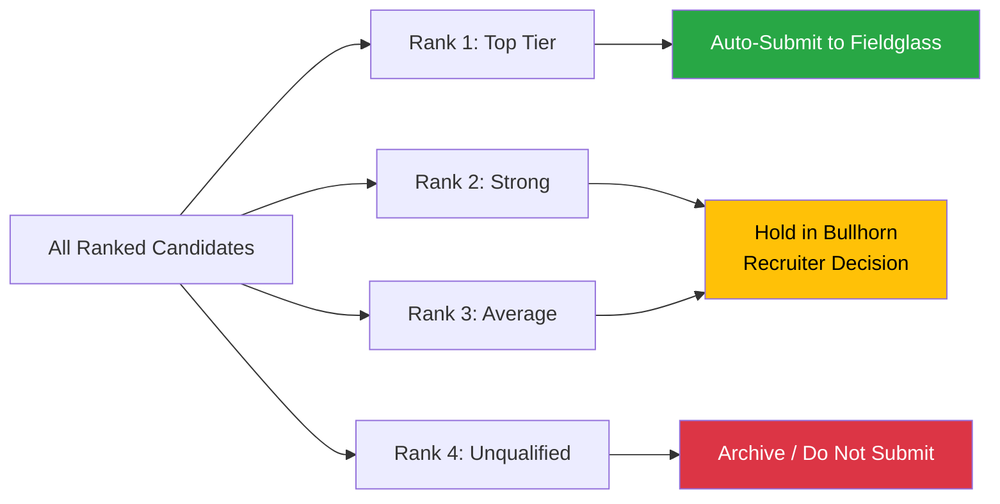
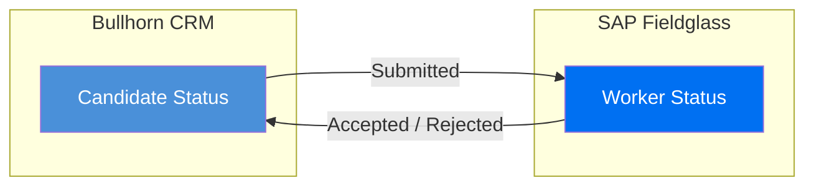
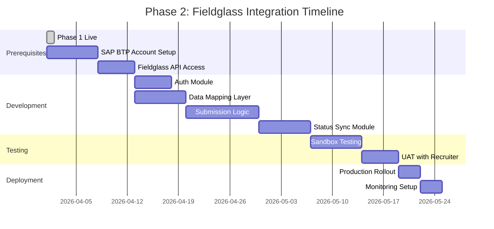
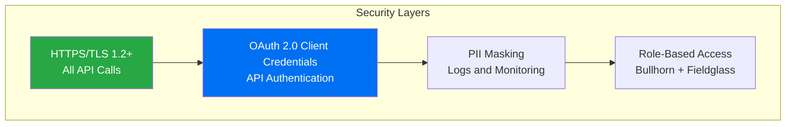

# Future State: SAP Fieldglass Integration

## Overview

This document outlines the Phase 2 roadmap for integrating SAP Fieldglass Vendor Management System (VMS) with the Bullhorn AI ranking engine. Once candidates are ranked in Bullhorn (Phase 1), Phase 2 will automatically submit top-ranked candidates to Fieldglass work orders, enabling end-to-end automation from evaluation to client submission.

**Prerequisite:** Phase 1 (Bullhorn AI Ranking) must be operational before beginning this integration.

---

## Business Case

### Current Manual Process



### Automated Future State



### Expected Benefits

| Benefit | Impact |
|---------|--------|
| Eliminate manual data entry | Save 15-30 minutes per submission |
| Reduce submission errors | Zero re-keying of candidate data |
| Faster time-to-submit | Submit within minutes of ranking |
| Consistent data format | Standardized submissions every time |
| Audit trail | Full visibility into submission history |

---

## SAP Fieldglass Platform Overview

### What is SAP Fieldglass?

SAP Fieldglass is a cloud-based Vendor Management System (VMS) used by large enterprises to manage contingent workforce programs. Clients (buyers) post work orders, and staffing agencies (suppliers) submit candidates through the platform.

### Key Concepts

| Concept | Description |
|---------|-------------|
| **Work Order** | A job requisition posted by the client in Fieldglass |
| **Worker Profile** | A candidate's profile submitted to a work order |
| **Supplier** | Your staffing agency (the vendor) |
| **Buyer** | The client company using Fieldglass |
| **Statement of Work (SOW)** | Contract defining the engagement terms |
| **Time Sheet** | Hours logged by the worker once placed |

---

## Authentication

### OAuth 2.0 Client Credentials Flow

SAP Fieldglass uses OAuth 2.0 with the Client Credentials grant type for server-to-server API access.



### Token Request

```http
POST /oauth2/token HTTP/1.1
Host: {tenant}.authentication.sap.hana.ondemand.com
Content-Type: application/x-www-form-urlencoded

grant_type=client_credentials
&client_id=YOUR_CLIENT_ID
&client_secret=YOUR_CLIENT_SECRET
```

### Token Response

```json
{
  "access_token": "eyJhbGciOiJSUzI1NiIs...",
  "token_type": "Bearer",
  "expires_in": 3600,
  "scope": "api.fieldglass"
}
```

> **Note:** Tokens typically expire in 1 hour. Implement proactive refresh 5 minutes before expiry.

---

## API Endpoints

### Authentication Setup

Before calling the Fieldglass API, you need:

1. **SAP BTP Account** - SAP Business Technology Platform tenant
2. **Fieldglass API Subscription** - Enabled in your SAP BTP cockpit
3. **Client Credentials** - Obtained from SAP BTP service key
4. **Supplier ID** - Your agency's Fieldglass supplier identifier
5. **API Base URL** - Varies by data center region

### Core Endpoints

| Operation | Method | Endpoint | Description |
|-----------|--------|----------|-------------|
| Get Work Orders | GET | `/api/v1/workorders` | Retrieve open work orders |
| Get Work Order Details | GET | `/api/v1/workorders/{id}` | Full details of a specific work order |
| Create Worker Profile | POST | `/api/v1/workorders/{id}/workers` | Submit candidate to a work order |
| Get Worker Status | GET | `/api/v1/workers/{id}/status` | Check submission status |
| Update Worker Profile | PUT | `/api/v1/workers/{workerId}` | Update candidate information |

---

## Integration Architecture

### End-to-End Data Flow



### Detailed Submission Workflow



---

## Data Mapping

### Bullhorn to Fieldglass Field Mapping

| Bullhorn Field | Fieldglass Field | Notes |
|----------------|-----------------|-------|
| `candidate.firstName` | `worker.firstName` | Direct mapping |
| `candidate.lastName` | `worker.lastName` | Direct mapping |
| `candidate.email` | `worker.email` | Primary email |
| `candidate.phone` | `worker.phone` | Primary phone |
| `candidate.description` | `worker.resume` | Resume text / attachment |
| `candidate.address.city` | `worker.location.city` | City |
| `candidate.address.country` | `worker.location.country` | ISO country code |
| `candidate.customInt1` (Rank) | N/A | Used for filtering Rank 1 only |
| `jobOrder.title` | `workOrder.title` | Reference only |
| `jobOrder.clientCorporation.name` | `workOrder.buyer` | Client name |

### Worker Profile Submission Payload

```json
{
  "worker": {
    "firstName": "Alanzo",
    "lastName": "Smith",
    "email": "alanzo.smith@email.com",
    "phone": "+1-555-0123",
    "location": {
      "city": "New York",
      "state": "NY",
      "country": "US"
    },
    "resume": {
      "text": "Senior Java Developer with 7 years of experience...",
      "format": "TEXT"
    },
    "rate": {
      "amount": 85.00,
      "currency": "USD",
      "unit": "HOURLY"
    },
    "availability": {
      "startDate": "2026-04-15",
      "type": "FULL_TIME"
    },
    "skills": [
      {"name": "Java", "proficiency": "EXPERT"},
      {"name": "Spring Boot", "proficiency": "EXPERT"},
      {"name": "AWS", "proficiency": "ADVANCED"},
      {"name": "Docker", "proficiency": "ADVANCED"},
      {"name": "Kubernetes", "proficiency": "INTERMEDIATE"}
    ],
    "workHistory": [
      {
        "company": "Investment Bank Corp",
        "title": "Senior Java Developer",
        "startDate": "2022-01",
        "endDate": "2026-03",
        "description": "Led development of distributed microservices..."
      }
    ]
  }
}
```

---

## Submission Logic

### Rank-Based Filtering

Only candidates ranked **1 (Top Tier)** by the AI engine are eligible for automatic submission to Fieldglass.



### Pre-Submission Validation Checklist

Before submitting a candidate to Fieldglass, the middleware must verify:

- [ ] Candidate rank is 1 (Top Tier)
- [ ] Candidate has a valid email address
- [ ] Candidate has a phone number
- [ ] Resume/description is not empty
- [ ] Candidate has not already been submitted to this work order
- [ ] Work order is still open and accepting submissions
- [ ] Candidate is available within the work order timeline
- [ ] Bill rate is within the work order budget range

### Duplicate Detection

```python
def check_duplicate_submission(candidate_id, work_order_id):
    """
    Prevent submitting the same candidate to the same work order twice.
    Check submission history in Bullhorn or a local audit table.
    """
    # Check Bullhorn for existing submission record
    existing = bullhorn_search(
        entity="Placement",
        query=f"candidate.id:{candidate_id} "
              f"AND jobOrder.id:{work_order_id}"
    )
    return len(existing) > 0
```

---

## Bi-Directional Sync

### Status Synchronization



### Fieldglass Worker Status Values

| Fieldglass Status | Bullhorn Equivalent | Action |
|-------------------|-------------------|--------|
| Submitted | Application Submitted | Log submission in Bullhorn |
| Under Review | Application Submitted | No change |
| Interview Scheduled | Interview Stage | Update Bullhorn stage |
| Offer Extended | Offer Stage | Alert recruiter |
| Accepted / Confirmed | Placed | Create placement record |
| Rejected | Application Rejected | Update candidate status |
| Withdrawn | Application Withdrawn | Log withdrawal |

### Sync Polling Strategy

```
Poll Fieldglass API every 30 minutes for status changes on submitted workers.
Update Bullhorn candidate status accordingly.
Notify recruiter via email for status changes requiring action.
```

---

## Error Handling

### Fieldglass API Error Codes

| HTTP Status | Meaning | Recovery Action |
|-------------|---------|-----------------|
| **400** | Invalid request payload | Log error, validate data, do not retry |
| **401** | Token expired or invalid | Refresh token and retry |
| **403** | Insufficient permissions | Alert admin, check API scope |
| **409** | Duplicate submission | Log and skip (expected) |
| **429** | Rate limit exceeded | Wait and retry with backoff |
| **500** | Fieldglass server error | Retry 3x with exponential backoff |

### Retry Strategy

```python
import time

def submit_with_retry(payload, max_retries=3):
    for attempt in range(max_retries):
        response = fieldglass_submit(payload)

        if response.status_code == 200:
            return response  # Success

        if response.status_code == 409:
            return None  # Duplicate, not an error

        if response.status_code in (401, 429, 500):
            wait_time = 2 ** attempt  # 1s, 2s, 4s
            time.sleep(wait_time)
            continue

        break  # Non-retryable error

    return None  # All retries exhausted
```

---

## Implementation Timeline

### Phase 2 Rollout Plan



### Prerequisites Checklist

- [ ] Phase 1 (Bullhorn AI Ranking) is live and stable
- [ ] SAP BTP account provisioned
- [ ] Fieldglass API access granted by SAP
- [ ] Client credentials obtained from SAP BTP cockpit
- [ ] Supplier ID confirmed in Fieldglass
- [ ] Test work order available in Fieldglass sandbox
- [ ] Field mapping validated with sample data

---

## Security Considerations

### Data Flow Security



### Compliance Requirements

1. **GDPR/CCPA** - Mask candidate PII in logs (names, emails, phone numbers)
2. **Data Residency** - Confirm Fieldglass data center location matches compliance region
3. **Audit Trail** - Log all submissions, status changes, and errors
4. **Access Control** - Restrict API credentials to integration service account only
5. **Token Storage** - Store tokens in AWS Secrets Manager or Azure Key Vault

---

## Cost Estimation

### API Usage Costs

| Component | Estimated Cost | Notes |
|-----------|---------------|-------|
| SAP BTP Subscription | Varies | Contact SAP for pricing |
| Fieldglass API Calls | Included | Typically included in subscription |
| Additional Middleware | Minimal | Serverless function costs |
| Monitoring & Logging | Minimal | CloudWatch / Azure Monitor |

### ROI Impact

| Metric | Before (Manual) | After (Automated) |
|--------|-----------------|-------------------|
| Time per submission | 15-30 minutes | < 1 minute |
| Submissions per day | 5-10 | 20-50 |
| Data entry errors | 5-10% | < 1% |
| Time-to-submit | 1-2 hours | < 5 minutes |

---

## Risks and Mitigations

| Risk | Likelihood | Impact | Mitigation |
|------|-----------|--------|------------|
| Fieldglass API changes | Medium | High | Abstract API layer, version pinning |
| Rate limiting during peak | Medium | Medium | Implement queuing and backoff |
| Duplicate submissions | Low | Medium | Dedup check before submit |
| Token expiration mid-batch | Low | Low | Proactive token refresh |
| Fieldglass outage | Low | High | Queue submissions, retry on recovery |

---

## Related Documentation

- **README.md** - Executive overview and Phase 1 summary
- **ARCHITECTURE_AND_WORKFLOW.md** - System architecture for Phase 1
- **BULLHORN_IMPLEMENTATION_SPEC.md** - Bullhorn API specifications
- **LLM_PROMPT_ENGINEERING.md** - AI prompt design and ranking criteria
- **INTEGRATION_PROMPT.md** - Ready-to-use AI prompt implementation
