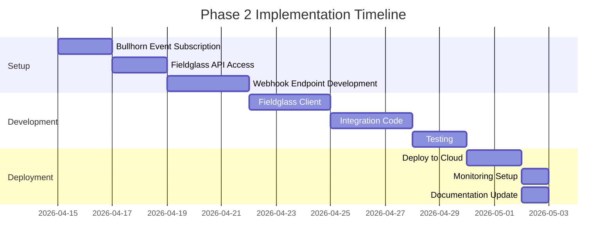

# Phase 2: Event-Driven Integration Implementation Plan

Generated: 2026-04-02
## Overview

This document outlines the step-by-step implementation plan for **Phase 2: Event-Driven Integration** approach, which provides real-time job acquisition and automated candidate submission to SAP Fieldglass.

## Prerequisites

Before starting this implementation, ensure:
- [x] Phase 1 (Bullhorn AI Ranking) is fully operational
- [x] Bullhorn API access is credentials
- [x] Fieldglass API access with OAuth 2.0 credentials
- [x] Bullhorn event subscription configured and- [x] Fieldglass webhook endpoint access configured
- [x] Development environment set up (Node.js 18+)

## Architecture
```mermaid
flowchart LR
    A[Fieldglass] -->|Webhook| B[Bullhorn Events]
    B -->|Process| C[Event Handler]
    C -->|Search| D[Search Candidates<br/>by job ID]
    D -->|Filter{ E[Filter Rank 1-2<br/>candidates]
    E -->|Submit| F[Submit to<br/>Fieldglass]
    F -->|Update| G[Update Bullhorn<br/>with Fieldglass ID]
    G -->|Notify| H[Notify recruiter]

    style C fill:#4A90D9,color:#fff
    style F fill:#28A745,color:#fff
```

## Step 1: Bullhorn Event Subscription Setup
1. Configure event subscription in Bullhorn:
   - Event Type: `JobOrder.ADD`
   - Criteria: Job requisitions created or updated
   - Callback URL: Your webhook endpoint
2. Test the subscription:
   ```bash
   # Using Bullhorn API or test the event subscription
   curl -X POST "https://rest.bullhornstaffing.com/rest-services/{entity}/JobOrder" \
     -H "Content-Type: application/json" \
     -d '{"eventName": "JobOrder.ADD", "criteria": {"id": 12345}}' \
     -H "BhRestToken: YOUR_TOKEN"
   ```

3. Verify subscription is active in Bullhorn
4. Document the webhook endpoint URL for your records

## Step 2: Webhook Endpoint Implementation
1. Create webhook endpoint to receive events
   ```javascript
   // webhook-handler.js
   const express = require('express');
   const bodyParser = require('body-parser');
   const BullhornClient = require('./bullhorn-client');
   const LLMRanker = require('./llm-ranker');
   const FieldglassClient = require('./fieldglass-client');

   const app = express();
   app.use(bodyParser.json());

   app.post('/webhook/job-order', async (req, res) => {
     try {
       const { eventId, entityType, entityIds } = req.body;

       if (entityType !== 'JobOrder') {
         return res.status(400).json({ error: 'Invalid entity type' });
       }

       console.log(`Received job order event: ${eventId}, IDs: ${entityIds}`);

       // Process each job order
       for (const jobId of entityIds) {
         await processJobOrder(jobId);
       }

       res.status(200).json({ received: true });
     } catch (error) {
       console.error('Webhook error:', error);
       res.status(500).json({ error: error.message });
     }
   });

   async function processJobOrder(jobId) {
     const bh = new BullhornClient(/* config */);
     const ranker = new LLMRanker(/* config */);

     // Get job description
     const jobDescription = await bh.getJobDescription(jobId);

     // Get candidates
     const candidates = await bh.searchCandidates(jobId);

     if (!candidates || candidates.length === 0) {
       console.log(`No candidates for job ${jobId}`);
       return;
     }

     // Filter Rank 1-2 candidates
     const topCandidates = candidates.filter(c => c c.rank && c.rank <= 2);

     if (topCandidates.length === 0) {
       console.log(`No top candidates for job ${jobId}`);
       return;
       }

     // Submit to Fieldglass
     for (const candidate of topCandidates) {
       try {
         const fieldglass = new FieldglassClient(/* config */);
         const submission = await fieldglass.submitCandidate(jobId, candidate);
         console.log(`Submitted candidate ${candidate.id} to Fieldglass`);

         // Update Bullhorn with Fieldglass ID
         await bh.updateCandidateFieldglassId(candidate.id, submission.id);
       } catch (error) {
         console.error(`Failed to submit candidate ${candidate.id}:`, error);
       }
     }
   }

   const port = process.env.PORT || 3000;
   app.listen(port, () => {
     console.log(`Webhook server listening on port ${port}`);
   });
   ```

2. Set up environment variables
   ```bash
   PORT=3000
   BH_CLIENT_ID=your_client_id
   BH_CLIENT_SECRET=your_client_secret
   BH_USERNAME=your_username
   BH_PASSWORD=your_password
   GEMINI_API_KEY=your_gemini_key
   FIELDGLASS_CLIENT_ID=your_fieldglass_id
   FIELDGLASS_CLIENT_SECRET=your_fieldglass_secret
   ```

3. Deploy webhook endpoint
   - Option A: AWS Lambda + API Gateway
   - Option B: Heroku/Render/other cloud provider
   - Option C: Docker container

## Step 3: Fieldglass Client Implementation
1. Create Fieldglass API client
   ```javascript
   // fieldglass-client.js
   const axios = require('axios');

   class FieldglassClient {
     constructor(config) {
       this.clientId = config.clientId;
       this.clientSecret = config.clientSecret;
       this.baseUrl = 'https://api.fieldglass.com/api/v1';
       this.accessToken = null;
     }

     async authenticate() {
       // OAuth 2.0 client credentials flow
       const response = await axios.post(
         `${this.baseUrl}/oauth/token`,
         {
           grant_type: 'client_credentials',
           client_id: this.clientId,
           client_secret: this.clientSecret,
           scope: 'candidate:submit'
         }
       );

       this.accessToken = response.data.access_token;
       return this;
     }

     async submitCandidate(jobId, candidate) {
       if (!this.accessToken) {
         await this.authenticate();
       }

       const payload = {
         job_id: jobId,
         candidate: {
           first_name: candidate.firstName,
           last_name: candidate.lastName,
           email: candidate.email,
           phone: candidate.phone,
           resume_url: candidate.resumeUrl,
           skills: candidate.primarySkills?.map(s => s.name),
           experience_years: candidate.experienceYears,
           availability: candidate.availability
         }
       };

       const response = await axios.post(
         `${this.baseUrl}/candidates`,
         payload,
         {
           headers: {
             'Authorization': `Bearer ${this.accessToken}`,
             'Content-Type': 'application/json'
           }
         }
       );

       return response.data;
     }
   }

   module.exports = FieldglassClient;
   ```

2. Test Fieldglass integration
   - Use sandbox environment first
   - Verify OAuth 2.0 authentication works
   - Test candidate submission with sample data

## Step 4: Update Bullhorn Client
1. Add method to update Fieldglass submission ID
   ```javascript
   async updateCandidateFieldglassId(candidateId, fieldglassId) {
     const url = `${this.restUrl}entity/Candidate/${candidateId}`;
     const payload = {
       customText1: fieldglassId  // Store Fieldglass submission ID
     };

     await axios.post(url, payload, {
       params: { BhRestToken: this.token }
     });
   }
   ```

## Step 5: Testing
1. Create integration test
   ```javascript
   // test/integration.test.js
   const assert = require('assert');
   const BullhornClient = require('../src/bullhorn-client');
   const LLMRanker = require('../src/llm-ranker');
   const FieldglassClient = require('../src/fieldglass-client');

   describe('Phase 2 Integration', () => {
     it('should authenticate with all services', async () => {
       // Test Bullhorn auth
       const bh = new BullhornClient(config);
       await bh.authenticate();
       assert.ok(bh.token);

       // Test Fieldglass auth
       const fg = new FieldglassClient(config);
       await fg.authenticate();
       assert.ok(fg.accessToken);
     });

     it('should submit top candidates to Fieldglass', async () => {
       // This test requires mock servers or sandbox environments
     });
   });
   ```

2. Test with real data (small sample)
   - Use 1-2 real job orders
   - Verify candidates are submitted correctly
   - Check Fieldglass receives the data

## Step 6: Deployment
1. Deploy to cloud provider
   - AWS Lambda: Package as Lambda function
   - API Gateway: Create REST API
   - Environment variables: Use AWS Secrets Manager

2. Set up monitoring
   - CloudWatch Logs: Stream logs
   - CloudWatch Alarms: Alert on errors
   - X-Ray: Trace requests (optional)

3. Configure scaling
   - Lambda: Set concurrency limits
   - API Gateway: Throttling limits

## Timeline


## Cost Estimation
- **Bullhorn API calls**: ~$0.001 per call (covered in Phase 1)
- **Fieldglass API calls**: ~$0.001 per call
- **Gemini API calls**: ~$0.02 per candidate (reuse Phase 1 rankings)
- **Lambda execution**: ~$0.20 per 1M requests
- **Total estimated cost**: ~$50-100/month for moderate volume

## Success Metrics
- **Submission time**: < 30 seconds from job creation to Fieldglass submission
- **Error rate**: < 1% failed submissions
- **Recruiter satisfaction**: Measured via feedback
- **Time saved**: 4-6 hours per week per recruiter

## Risks and Mitigations
| Risk | Mitigation |
|------|------------|
| Fieldglass API downtime | Retry logic, queue failed submissions |
| Webhook delivery failure | Polling fallback option |
| Duplicate submissions | Idempotency checks in Fieldglass client |
| Fieldglass API changes | Version API, monitor Fieldglass changelog |

## Next Steps
1. **Review this plan** - Ensure it aligns with your requirements
2. **Gather Fieldglass credentials** - Contact Fieldglass support
3. **Set up development environment** - Create test webhook endpoint
4. **Implement Fieldglass client** - Start with authentication
5. **Test thoroughly** - Use sandbox environment
6. **Deploy to production** - Monitor closely for first week

## Questions?
Contact your implementation team or refer to the Bullhorn API Reference documentation.
