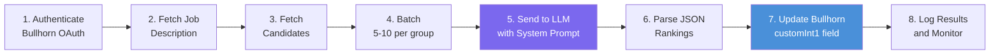

# Integration Prompt

## Overview

This document provides a ready-to-use implementation for the Bullhorn AI candidate ranking system. It includes the complete LLM prompt, integration code snippets in Python and JavaScript, and step-by-step instructions for connecting the AI engine to Bullhorn CRM.

---

## The Complete Prompt

### System Prompt

Copy this system prompt exactly. It defines the AI's role, evaluation criteria, and output format.

```
You are an expert Recruitment Process Consultant and Senior Technical Recruiter with 15+ years of experience in candidate evaluation. Your goal is to critically evaluate candidates against a provided Job Description and rank each candidate on a scale of 1 to 4.

RANKING SCALE:
1 - Top Tier: Exceptional match. Meets all required and preferred skills with outstanding experience.
2 - Strong: Solid match. Meets all required skills and some preferred skills.
3 - Average: Meets most required skills but lacks key experience. May need upskilling.
4 - Unqualified: Does not meet the baseline requirements.

EVALUATION INSTRUCTIONS:
1. Critically analyze each Candidate's resume/description against the Job Description.
2. Be objective, data-driven, and thorough in your evaluation.
3. Consider both technical skills and relevant experience.
4. Be selective - reserve Rank 1 for truly exceptional candidates.
5. Evaluate EVERY candidate in the provided list. Do not skip any.
6. Return the results STRICTLY as a valid JSON array.
7. Do NOT include markdown formatting, conversational text, or explanations outside the JSON structure.

EXPECTED JSON FORMAT:
[
  {
    "candidate_id": 123456,
    "rank": 2,
    "justification": "Brief explanation of the ranking decision"
  }
]
```

### User Prompt Template

Use this template and replace the `{{VARIABLES}}` with actual data at runtime.

```
JOB DESCRIPTION:
{{JOB_DESCRIPTION}}

CANDIDATES:
{{CANDIDATE_DATA}}
```

---

## Variable Injection Points

### Variables Reference

| Variable | Source | Format | Description |
|----------|--------|--------|-------------|
| `{{JOB_DESCRIPTION}}` | Bullhorn `JobOrder.description` | Plain text | The full job description including requirements |
| `{{CANDIDATE_DATA}}` | Bullhorn `Candidate` search results | JSON array | Candidate records with id, name, description, skills |

### Job Description Format

The `{{JOB_DESCRIPTION}}` variable should include:

```
Senior Java Developer

REQUIRED SKILLS:
- 5+ years Java development experience
- Strong understanding of Spring Boot framework
- Experience with microservices architecture
- Proficiency in SQL and database design
- Experience with CI/CD pipelines

PREFERRED SKILLS:
- AWS certification or extensive AWS experience
- Experience with Docker and Kubernetes
- Knowledge of message queues (RabbitMQ, Kafka)
- Previous experience in financial services

RESPONSIBILITIES:
- Design and develop scalable microservices
- Collaborate with cross-functional teams
- Mentor junior developers
- Participate in code reviews and architectural decisions
```

### Candidate Data Format

The `{{CANDIDATE_DATA}}` variable should be a JSON array:

```json
[
  {
    "id": 5059165,
    "firstName": "Alanzo",
    "lastName": "Smith",
    "description": "Senior Java Developer with 7 years of experience in enterprise applications. Extensive experience with Spring Boot, microservices, and AWS. AWS Solutions Architect certified. Led development of distributed systems processing 1M+ transactions/day.",
    "primarySkills": [
      {"name": "Java"},
      {"name": "Spring Boot"},
      {"name": "AWS"},
      {"name": "Docker"},
      {"name": "Kubernetes"}
    ]
  },
  {
    "id": 5059166,
    "firstName": "Janis",
    "lastName": "Williams",
    "description": "Junior developer with 1 year of Python experience. Familiar with Django framework. Recently completed a coding bootcamp.",
    "primarySkills": [
      {"name": "Python"},
      {"name": "Django"}
    ]
  }
]
```

---

## Python Implementation

### Complete Integration Script

```python
import json
import os
import re
import time
import logging
import requests
from datetime import datetime, timedelta

logging.basicConfig(level=logging.INFO)
logger = logging.getLogger(__name__)

# ============================================================
# CONFIGURATION
# ============================================================

BULLHORN_CONFIG = {
    "client_id": os.environ.get("BH_CLIENT_ID"),
    "client_secret": os.environ.get("BH_CLIENT_SECRET"),
    "username": os.environ.get("BH_USERNAME"),
    "password": os.environ.get("BH_PASSWORD"),
    "auth_url": "https://auth.bullhornstaffing.com/oauth/authorize",
    "token_url": "https://auth.bullhornstaffing.com/oauth/token",
    "login_url": "https://rest.bullhornstaffing.com/rest-services/login",
}

LLM_CONFIG = {
    "api_key": os.environ.get("LLM_API_KEY"),
    "model": "gpt-4",
    "temperature": 0.2,
    "max_tokens": 2000,
    "api_url": "https://api.openai.com/v1/chat/completions",
}

RANKING_FIELD = "customInt1"
BATCH_SIZE = 10
MAX_RETRIES = 3

# ============================================================
# SYSTEM PROMPT
# ============================================================

SYSTEM_PROMPT = """You are an expert Recruitment Process Consultant and Senior Technical Recruiter with 15+ years of experience in candidate evaluation. Your goal is to critically evaluate candidates against a provided Job Description and rank each candidate on a scale of 1 to 4.

RANKING SCALE:
1 - Top Tier: Exceptional match. Meets all required and preferred skills with outstanding experience.
2 - Strong: Solid match. Meets all required skills and some preferred skills.
3 - Average: Meets most required skills but lacks key experience. May need upskilling.
4 - Unqualified: Does not meet the baseline requirements.

EVALUATION INSTRUCTIONS:
1. Critically analyze each Candidate's resume/description against the Job Description.
2. Be objective, data-driven, and thorough in your evaluation.
3. Consider both technical skills and relevant experience.
4. Be selective - reserve Rank 1 for truly exceptional candidates.
5. Evaluate EVERY candidate in the provided list. Do not skip any.
6. Return the results STRICTLY as a valid JSON array.
7. Do NOT include markdown formatting, conversational text, or explanations outside the JSON structure.

EXPECTED JSON FORMAT:
[
  {
    "candidate_id": 123456,
    "rank": 2,
    "justification": "Brief explanation of the ranking decision"
  }
]"""


# ============================================================
# BULLHORN API CLIENT
# ============================================================

class BullhornClient:
    def __init__(self):
        self.rest_url = None
        self.token = None
        self.token_expiry = None

    def authenticate(self):
        """Authenticate with Bullhorn and get BhRestToken."""
        logger.info("Authenticating with Bullhorn...")

        params = {
            "client_id": BULLHORN_CONFIG["client_id"],
            "client_secret": BULLHORN_CONFIG["client_secret"],
            "username": BULLHORN_CONFIG["username"],
            "password": BULLHORN_CONFIG["password"],
            "grant_type": "password",
        }

        response = requests.post(BULLHORN_CONFIG["token_url"], data=params)
        response.raise_for_status()
        access_token = response.json()["access_token"]

        params = {"access_token": access_token}
        response = requests.get(BULLHORN_CONFIG["login_url"], params=params)
        response.raise_for_status()
        data = response.json()

        self.rest_url = data["restUrl"]
        self.token = data["BhRestToken"]
        self.token_expiry = datetime.now() + timedelta(hours=8)

        logger.info("Authentication successful.")
        return self

    def _ensure_auth(self):
        if not self.token or datetime.now() >= self.token_expiry:
            self.authenticate()

    def search_candidates(self, job_order_id):
        """Search for candidates associated with a job order."""
        self._ensure_auth()
        url = f"{self.rest_url}search/Candidate"

        params = {
            "BhRestToken": self.token,
            "query": f"jobSubmissions.jobOrder.id:{job_order_id}",
            "fields": "id,firstName,lastName,description,primarySkills",
            "count": 500,
        }

        response = requests.get(url, params=params)
        response.raise_for_status()
        return response.json()["data"]

    def get_job_description(self, job_order_id):
        """Get the job description for a specific job order."""
        self._ensure_auth()
        url = f"{self.rest_url}entity/JobOrder/{job_order_id}"

        params = {
            "BhRestToken": self.token,
            "fields": "id,title,description,publicDescription",
        }

        response = requests.get(url, params=params)
        response.raise_for_status()
        data = response.json()["data"]

        return data.get("publicDescription") or data.get("description") or data.get("title", "")

    def update_candidate_rank(self, candidate_id, rank):
        """Update a candidate's ranking field in Bullhorn."""
        self._ensure_auth()
        url = f"{self.rest_url}entity/Candidate/{candidate_id}"

        payload = {
            RANKING_FIELD: rank,
        }

        params = {"BhRestToken": self.token}

        for attempt in range(MAX_RETRIES):
            try:
                response = requests.post(url, json=payload, params=params)
                if response.status_code == 200:
                    logger.info(f"Updated candidate {candidate_id} to rank {rank}")
                    return True
                if response.status_code == 401:
                    self.authenticate()
                    continue
                response.raise_for_status()
            except requests.exceptions.RequestException as e:
                logger.warning(f"Attempt {attempt + 1} failed for candidate {candidate_id}: {e}")
                if attempt < MAX_RETRIES - 1:
                    time.sleep(2 ** attempt)
                continue

        logger.error(f"Failed to update candidate {candidate_id} after {MAX_RETRIES} retries")
        return False


# ============================================================
# LLM CLIENT
# ============================================================

class LLMClient:
    def __init__(self):
        self.api_key = LLM_CONFIG["api_key"]

    def rank_candidates(self, job_description, candidates):
        """Send candidates to LLM and get rankings."""
        headers = {
            "Authorization": f"Bearer {self.api_key}",
            "Content-Type": "application/json",
        }

        candidate_data = json.dumps(candidates, indent=2)
        user_prompt = f"JOB DESCRIPTION:\n{job_description}\n\nCANDIDATES:\n{candidate_data}"

        payload = {
            "model": LLM_CONFIG["model"],
            "temperature": LLM_CONFIG["temperature"],
            "max_tokens": LLM_CONFIG["max_tokens"],
            "messages": [
                {"role": "system", "content": SYSTEM_PROMPT},
                {"role": "user", "content": user_prompt},
            ],
        }

        response = requests.post(LLM_CONFIG["api_url"], headers=headers, json=payload)
        response.raise_for_status()

        return self.parse_response(response.json()["choices"][0]["message"]["content"])

    def parse_response(self, response_text):
        """Parse LLM response and extract rankings."""
        cleaned = re.sub(r"```json\s*", "", response_text)
        cleaned = re.sub(r"```\s*", "", cleaned).strip()

        rankings = json.loads(cleaned)

        if not isinstance(rankings, list):
            raise ValueError("Response is not a JSON array")

        validated = []
        for item in rankings:
            if not isinstance(item, dict):
                continue
            if "candidate_id" not in item or "rank" not in item:
                continue

            rank = int(item["rank"])
            if rank < 1 or rank > 4:
                continue

            validated.append({
                "candidate_id": int(item["candidate_id"]),
                "rank": rank,
                "justification": item.get("justification", ""),
            })

        return validated


# ============================================================
# ORCHESTRATOR
# ============================================================

def run_ranking(job_order_id):
    """Main orchestration: extract, evaluate, write-back."""
    logger.info(f"Starting ranking for job order {job_order_id}")

    bh = BullhornClient().authenticate()
    llm = LLMClient()

    # Step 1: Get job description
    job_description = bh.get_job_description(job_order_id)
    if not job_description:
        logger.error(f"No job description found for job order {job_order_id}")
        return

    # Step 2: Get candidates
    candidates = bh.search_candidates(job_order_id)
    if not candidates:
        logger.info(f"No candidates found for job order {job_order_id}")
        return

    logger.info(f"Found {len(candidates)} candidates for job order {job_order_id}")

    # Step 3: Batch and evaluate
    all_rankings = []
    for i in range(0, len(candidates), BATCH_SIZE):
        batch = candidates[i : i + BATCH_SIZE]
        logger.info(f"Processing batch {i // BATCH_SIZE + 1}: {len(batch)} candidates")

        try:
            rankings = llm.rank_candidates(job_description, batch)
            all_rankings.extend(rankings)
        except Exception as e:
            logger.error(f"Failed to process batch {i // BATCH_SIZE + 1}: {e}")

    # Step 4: Write rankings back to Bullhorn
    success_count = 0
    fail_count = 0
    for ranking in all_rankings:
        if bh.update_candidate_rank(ranking["candidate_id"], ranking["rank"]):
            success_count += 1
        else:
            fail_count += 1

    logger.info(
        f"Ranking complete for job order {job_order_id}. "
        f"Success: {success_count}, Failed: {fail_count}"
    )


if __name__ == "__main__":
    JOB_ORDER_ID = int(os.environ.get("JOB_ORDER_ID", 0))
    if JOB_ORDER_ID:
        run_ranking(JOB_ORDER_ID)
    else:
        logger.error("JOB_ORDER_ID environment variable is required")
```

---

## JavaScript / Node.js Implementation

### Bullhorn Authentication Module

```javascript
// bullhorn-client.js
const axios = require('axios');

class BullhornClient {
  constructor(config) {
    this.clientId = config.clientId;
    this.clientSecret = config.clientSecret;
    this.username = config.username;
    this.password = config.password;
    this.restUrl = null;
    this.token = null;
  }

  async authenticate() {
    const tokenResponse = await axios.post(
      'https://auth.bullhornstaffing.com/oauth/token',
      new URLSearchParams({
        grant_type: 'password',
        client_id: this.clientId,
        client_secret: this.clientSecret,
        username: this.username,
        password: this.password,
      })
    );

    const { access_token } = tokenResponse.data;

    const loginResponse = await axios.get(
      'https://rest.bullhornstaffing.com/rest-services/login',
      { params: { access_token } }
    );

    this.restUrl = loginResponse.data.restUrl;
    this.token = loginResponse.data.BhRestToken;
    return this;
  }

  async searchCandidates(jobOrderId) {
    const url = `${this.restUrl}search/Candidate`;
    const response = await axios.get(url, {
      params: {
        BhRestToken: this.token,
        query: `jobSubmissions.jobOrder.id:${jobOrderId}`,
        fields: 'id,firstName,lastName,description,primarySkills',
        count: 500,
      },
    });
    return response.data.data;
  }

  async getJobDescription(jobOrderId) {
    const url = `${this.restUrl}entity/JobOrder/${jobOrderId}`;
    const response = await axios.get(url, {
      params: {
        BhRestToken: this.token,
        fields: 'id,title,description,publicDescription',
      },
    });
    const data = response.data.data;
    return data.publicDescription || data.description || data.title || '';
  }

  async updateCandidateRank(candidateId, rank) {
    const url = `${this.restUrl}entity/Candidate/${candidateId}`;
    await axios.post(url, { customInt1: rank }, {
      params: { BhRestToken: this.token },
    });
  }
}

module.exports = BullhornClient;
```

### LLM Ranking Module

```javascript
// llm-client.js
const axios = require('axios');

const SYSTEM_PROMPT = `You are an expert Recruitment Process Consultant and Senior Technical Recruiter with 15+ years of experience in candidate evaluation. Your goal is to critically evaluate candidates against a provided Job Description and rank each candidate on a scale of 1 to 4.

RANKING SCALE:
1 - Top Tier: Exceptional match. Meets all required and preferred skills with outstanding experience.
2 - Strong: Solid match. Meets all required skills and some preferred skills.
3 - Average: Meets most required skills but lacks key experience. May need upskilling.
4 - Unqualified: Does not meet the baseline requirements.

EVALUATION INSTRUCTIONS:
1. Critically analyze each Candidate's resume/description against the Job Description.
2. Be objective, data-driven, and thorough in your evaluation.
3. Consider both technical skills and relevant experience.
4. Be selective - reserve Rank 1 for truly exceptional candidates.
5. Evaluate EVERY candidate in the provided list. Do not skip any.
6. Return the results STRICTLY as a valid JSON array.
7. Do NOT include markdown formatting, conversational text, or explanations outside the JSON structure.

EXPECTED JSON FORMAT:
[
  {
    "candidate_id": 123456,
    "rank": 2,
    "justification": "Brief explanation of the ranking decision"
  }
]`;

class LLMClient {
  constructor(config) {
    this.apiKey = config.apiKey;
    this.model = config.model || 'gpt-4';
    this.temperature = config.temperature || 0.2;
    this.apiUrl = config.apiUrl || 'https://api.openai.com/v1/chat/completions';
  }

  async rankCandidates(jobDescription, candidates) {
    const response = await axios.post(
      this.apiUrl,
      {
        model: this.model,
        temperature: this.temperature,
        max_tokens: 2000,
        messages: [
          { role: 'system', content: SYSTEM_PROMPT },
          {
            role: 'user',
            content: `JOB DESCRIPTION:\n${jobDescription}\n\nCANDIDATES:\n${JSON.stringify(candidates, null, 2)}`,
          },
        ],
      },
      {
        headers: {
          Authorization: `Bearer ${this.apiKey}`,
          'Content-Type': 'application/json',
        },
      }
    );

    const raw = response.data.choices[0].message.content;
    return this.parseResponse(raw);
  }

  parseResponse(text) {
    const cleaned = text.replace(/```json\s*/, '').replace(/```\s*/, '').trim();
    const rankings = JSON.parse(cleaned);

    if (!Array.isArray(rankings)) {
      throw new Error('Response is not a JSON array');
    }

    return rankings
      .filter((item) => item.candidate_id && item.rank)
      .map((item) => ({
        candidate_id: parseInt(item.candidate_id, 10),
        rank: Math.min(4, Math.max(1, parseInt(item.rank, 10))),
        justification: item.justification || '',
      }));
  }
}

module.exports = LLMClient;
```

### Main Orchestrator

```javascript
// index.js
const BullhornClient = require('./bullhorn-client');
const LLMClient = require('./llm-client');

const BATCH_SIZE = 10;

async function runRanking(jobOrderId) {
  const bh = await new BullhornClient({
    clientId: process.env.BH_CLIENT_ID,
    clientSecret: process.env.BH_CLIENT_SECRET,
    username: process.env.BH_USERNAME,
    password: process.env.BH_PASSWORD,
  }).authenticate();

  const llm = new LLMClient({
    apiKey: process.env.LLM_API_KEY,
    model: 'gpt-4',
    temperature: 0.2,
  });

  const jobDescription = await bh.getJobDescription(jobOrderId);
  if (!jobDescription) {
    throw new Error(`No job description for job order ${jobOrderId}`);
  }

  const candidates = await bh.searchCandidates(jobOrderId);
  console.log(`Found ${candidates.length} candidates`);

  const allRankings = [];
  for (let i = 0; i < candidates.length; i += BATCH_SIZE) {
    const batch = candidates.slice(i, i + BATCH_SIZE);
    console.log(`Processing batch ${Math.floor(i / BATCH_SIZE) + 1}: ${batch.length} candidates`);

    const rankings = await llm.rankCandidates(jobDescription, batch);
    allRankings.push(...rankings);
  }

  let successCount = 0;
  let failCount = 0;

  for (const ranking of allRankings) {
    try {
      await bh.updateCandidateRank(ranking.candidate_id, ranking.rank);
      successCount++;
    } catch (err) {
      console.error(`Failed to update candidate ${ranking.candidate_id}:`, err.message);
      failCount++;
    }
  }

  console.log(`Done. Success: ${successCount}, Failed: ${failCount}`);
}

const jobId = parseInt(process.env.JOB_ORDER_ID, 10);
if (jobId) {
  runRanking(jobId).catch(console.error);
} else {
  console.error('JOB_ORDER_ID environment variable is required');
}
```

---

## Environment Variables

### Required Environment Variables

Create a `.env` file or set these in your deployment environment:

```bash
# Bullhorn CRM Credentials
BH_CLIENT_ID=your_bullhorn_client_id
BH_CLIENT_SECRET=your_bullhorn_client_secret
BH_USERNAME=your_bullhorn_username
BH_PASSWORD=your_bullhorn_password

# LLM API Credentials
LLM_API_KEY=your_openai_or_llm_api_key

# Job Order to Process
JOB_ORDER_ID=12345
```

> **Important:** Never commit `.env` files to version control. Add `.env` to your `.gitignore`.

---

## Running the Integration

### Python Quick Start

```bash
# Install dependencies
pip install requests

# Set environment variables
export BH_CLIENT_ID="..."
export BH_CLIENT_SECRET="..."
export BH_USERNAME="..."
export BH_PASSWORD="..."
export LLM_API_KEY="..."
export JOB_ORDER_ID="12345"

# Run the integration
python integration.py
```

### Node.js Quick Start

```bash
# Install dependencies
npm init -y
npm install axios dotenv

# Create .env file (see above)

# Run the integration
node index.js
```

### Docker Deployment

```dockerfile
FROM python:3.11-slim

WORKDIR /app
COPY requirements.txt .
RUN pip install --no-cache-dir -r requirements.txt

COPY integration.py .

CMD ["python", "integration.py"]
```

```bash
# Build and run
docker build -t bh-ranking .
docker run --env-file .env bh-ranking
```

### Scheduled Execution (Cron)

```cron
# Run ranking every weekday at 8:00 AM
0 8 * * 1-5 /usr/bin/python3 /app/integration.py >> /var/log/bh-ranking.log 2>&1
```

### AWS Lambda Deployment

```python
# lambda_handler.py
import os
from integration import run_ranking

def lambda_handler(event, context):
    job_order_id = int(os.environ.get("JOB_ORDER_ID", 0))
    if not job_order_id:
        return {"statusCode": 400, "body": "JOB_ORDER_ID not set"}

    try:
        run_ranking(job_order_id)
        return {"statusCode": 200, "body": "Ranking completed successfully"}
    except Exception as e:
        return {"statusCode": 500, "body": str(e)}
```

---

## Testing

### Unit Test Template (Python)

```python
import json
import pytest
from unittest.mock import patch, MagicMock

def test_parse_response_valid():
    """Test parsing a valid LLM response."""
    from integration import LLMClient

    client = LLMClient()
    response = json.dumps([
        {"candidate_id": 123, "rank": 1, "justification": "Great match"},
        {"candidate_id": 456, "rank": 4, "justification": "No match"},
    ])

    rankings = client.parse_response(response)
    assert len(rankings) == 2
    assert rankings[0]["rank"] == 1
    assert rankings[1]["rank"] == 4

def test_parse_response_invalid_rank():
    """Test that ranks outside 1-4 are filtered out."""
    from integration import LLMClient

    client = LLMClient()
    response = json.dumps([
        {"candidate_id": 123, "rank": 1},
        {"candidate_id": 456, "rank": 5},  # Invalid
        {"candidate_id": 789, "rank": 0},  # Invalid
    ])

    rankings = client.parse_response(response)
    assert len(rankings) == 1
    assert rankings[0]["candidate_id"] == 123
```

---

## Response Handling

### Expected LLM Response Format

```json
[
  {
    "candidate_id": 5059165,
    "rank": 1,
    "justification": "Exceptional match. Meets all required skills (7 years Java, Spring Boot, microservices, SQL, CI/CD) and all preferred skills (AWS certified, Docker, Kubernetes, financial services experience)."
  },
  {
    "candidate_id": 5059166,
    "rank": 4,
    "justification": "Does not meet baseline requirements. Only 1 year Python experience, no Java, Spring Boot, or microservices knowledge."
  },
  {
    "candidate_id": 5059167,
    "rank": 2,
    "justification": "Strong match. Meets all required skills (6 years Java, Spring Boot, microservices, SQL). Limited CI/CD hands-on experience."
  }
]
```

### Error Scenarios and Recovery

| Scenario | Detection | Recovery |
|----------|-----------|----------|
| LLM returns markdown-wrapped JSON | Regex to strip code fences | Built into `parse_response` |
| LLM returns non-JSON | `JSONDecodeError` catch | Log error, skip batch |
| LLM returns wrong structure | Schema validation | Log error, skip invalid items |
| LLM misses candidates | Count comparison | Log warning, flag missing IDs |
| API rate limit hit | HTTP 429 | Exponential backoff, retry |
| Bullhorn auth failure | HTTP 401 | Re-authenticate and retry |

---

## Quick Reference

### One-Page Summary



### Key Files and Configuration

| Item | Value |
|------|-------|
| Bullhorn auth endpoint | `https://auth.bullhornstaffing.com/oauth/token` |
| Bullhorn login endpoint | `https://rest.bullhornstaffing.com/rest-services/login` |
| Ranking field | `customInt1` |
| Batch size | 5-10 candidates |
| Temperature | 0.1-0.3 |
| Token lifetime | ~8-10 hours |
| Recommended model | GPT-4, Claude 3.5 Sonnet, or Gemini Pro |

---

## Related Documentation

- **README.md** - Executive overview and project summary
- **ARCHITECTURE_AND_WORKFLOW.md** - System architecture and data flows
- **BULLHORN_IMPLEMENTATION_SPEC.md** - Bullhorn API specifications
- **LLM_PROMPT_ENGINEERING.md** - Detailed prompt design and evaluation criteria
- **FUTURE_STATE_FIELDGLASS_INTEGRATION.md** - Phase 2 roadmap for Fieldglass integration
