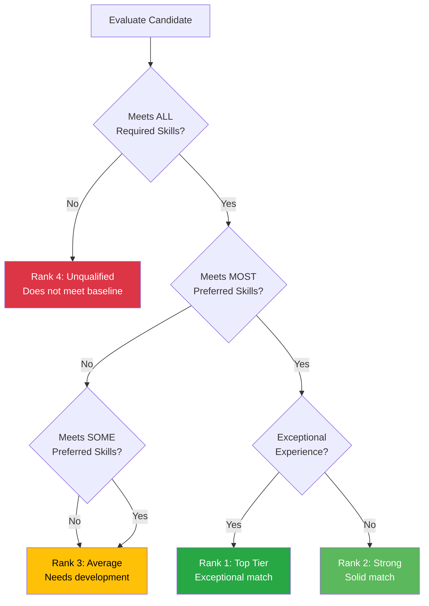
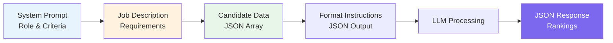
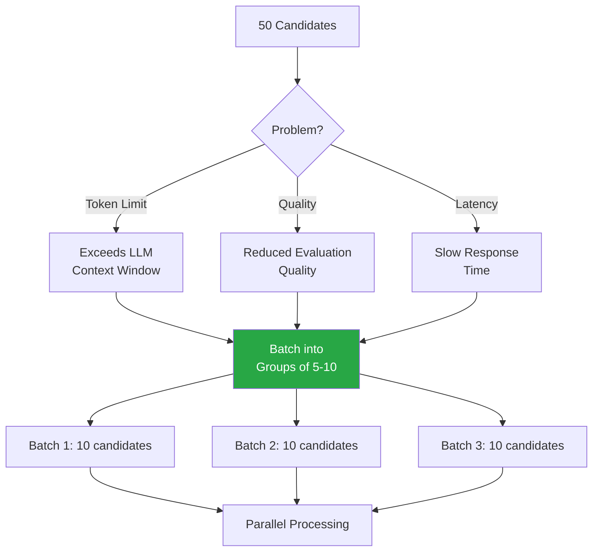
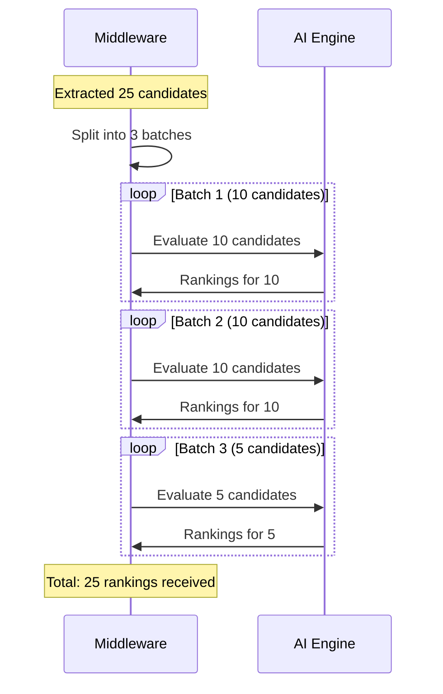
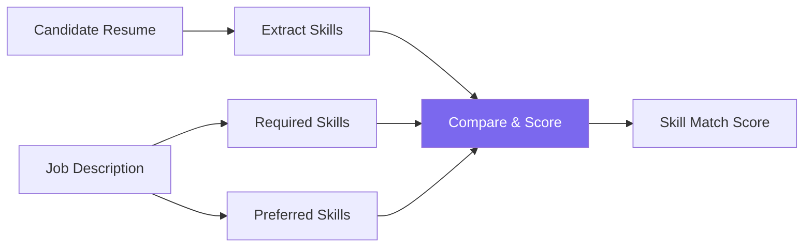
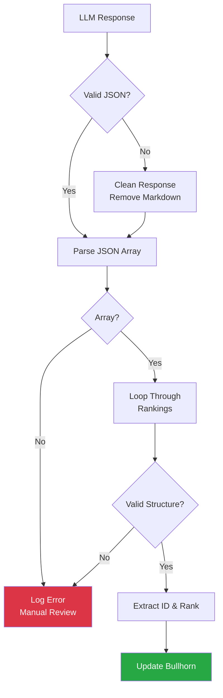
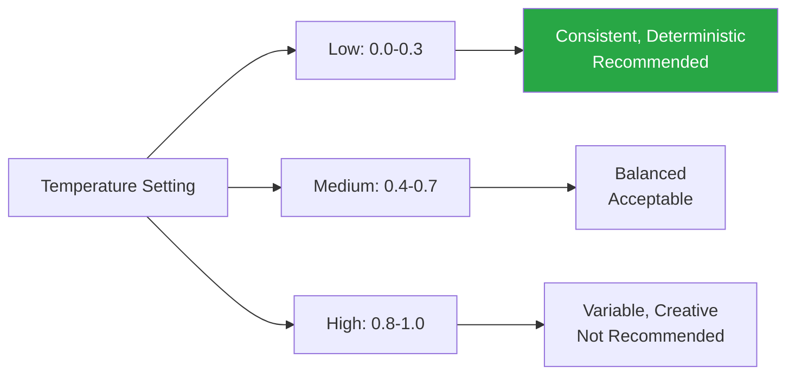
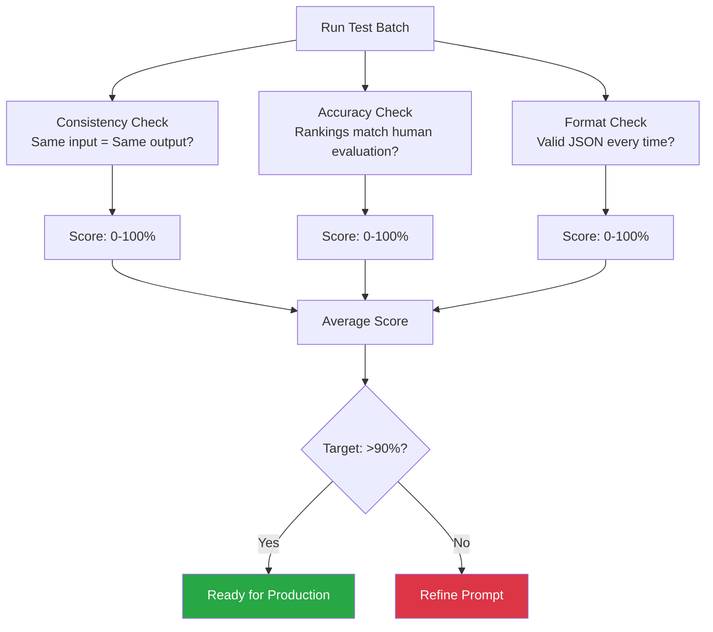

# LLM Prompt Engineering

## Overview

This document describes the prompt design and evaluation criteria for the AI-powered candidate ranking system. The prompt is engineered to produce consistent, structured JSON output that can be automatically processed by the integration middleware.

---

## Ranking Scale Definition

### The 1-4 Ranking System



### Detailed Ranking Criteria

| Rank | Label | Criteria | Example |
|------|-------|----------|---------|
| **1** | Top Tier | - Meets ALL required skills<br/>- Meets ALL preferred skills<br/>- Exceptional experience<br/>- Strong cultural indicators | 7+ years Java, AWS certified, led teams, relevant domain |
| **2** | Strong | - Meets ALL required skills<br/>- Meets SOME preferred skills<br/>- Solid experience level | 5 years Java, AWS experience, no certification |
| **3** | Average | - Meets MOST required skills<br/>- Missing key experience<br/>- May need upskilling | 3 years Java, no AWS, eager to learn |
| **4** | Unqualified | - Missing critical required skills<br/>- Insufficient experience<br/>- Does not meet baseline | 1 year Java, no cloud experience |

---

## System Prompt Design

### Core System Prompt

The system prompt sets the AI's role and evaluation criteria:

```
You are an expert Recruitment Process Consultant and Senior Technical Recruiter with 15+ years of experience in candidate evaluation. Your goal is to critically evaluate candidates against a provided Job Description and rank each candidate on a scale of 1 to 4.

RANKING SCALE:
1 - Top Tier: Exceptional match. Meets all required and preferred skills with outstanding experience.
2 - Strong: Solid match. Meets all required skills and some preferred skills.
3 - Average: Meets most required skills but lacks key experience. May need upskilling.
4 - Unqualified: Does not meet the baseline requirements.

EVALUATION INSTRUCTIONS:
1. Critically analyze the Candidate's resume/description against the Job Description.
2. Be objective, data-driven, and thorough in your evaluation.
3. Consider both technical skills and relevant experience.
4. Be selective - reserve Rank 1 for truly exceptional candidates.
5. Return the results STRICTLY as a valid JSON array.
6. Do NOT include markdown formatting, conversational text, or explanations outside the JSON structure.

EXPECTED JSON FORMAT:
[
  {
    "candidate_id": 123456,
    "rank": 2,
    "justification": "Brief explanation of the ranking decision"
  }
]
```

---

## Prompt Structure

### Complete Prompt Template



### Payload Structure

```json
{
  "messages": [
    {
      "role": "system",
      "content": "You are an expert Recruitment Process Consultant..."
    },
    {
      "role": "user",
      "content": "JOB DESCRIPTION:\n{{JOB_DESCRIPTION}}\n\nCANDIDATES:\n{{CANDIDATE_DATA}}"
    }
  ],
  "response_format": { "type": "json_object" }
}
```

---

## Example Prompt

### Full Example with Sample Data

**System Message:**
```
You are an expert Recruitment Process Consultant and Senior Technical Recruiter with 15+ years of experience in candidate evaluation. Your goal is to critically evaluate candidates against a provided Job Description and rank each candidate on a scale of 1 to 4.

RANKING SCALE:
1 - Top Tier: Exceptional match. Meets all required and preferred skills with outstanding experience.
2 - Strong: Solid match. Meets all required skills and some preferred skills.
3 - Average: Meets most required skills but lacks key experience. May need upskilling.
4 - Unqualified: Does not meet the baseline requirements.

EVALUATION INSTRUCTIONS:
1. Critically analyze the Candidate's resume/description against the Job Description.
2. Be objective, data-driven, and thorough in your evaluation.
3. Consider both technical skills and relevant experience.
4. Be selective - reserve Rank 1 for truly exceptional candidates.
5. Return the results STRICTLY as a valid JSON array.

EXPECTED JSON FORMAT:
[
  {
    "candidate_id": 123456,
    "rank": 2,
    "justification": "Brief explanation of the ranking decision"
  }
]
```

**User Message:**
```
JOB DESCRIPTION:
Senior Java Developer

REQUIRED SKILLS:
- 5+ years Java development experience
- Strong understanding of Spring Boot framework
- Experience with microservices architecture
- Proficiency in SQL and database design
- Experience with CI/CD pipelines

PREFERRED SKILLS:
- AWS certification or extensive AWS experience
- Experience with Docker and Kubernetes
- Knowledge of message queues (RabbitMQ, Kafka)
- Previous experience in financial services

RESPONSIBILITIES:
- Design and develop scalable microservices
- Collaborate with cross-functional teams
- Mentor junior developers
- Participate in code reviews and architectural decisions

---

CANDIDATES:
[
  {
    "id": 5059165,
    "firstName": "Alanzo",
    "lastName": "Smith",
    "description": "Senior Java Developer with 7 years of experience in enterprise applications. Extensive experience with Spring Boot, microservices, and AWS. AWS Solutions Architect certified. Led development of distributed systems processing 1M+ transactions/day. Strong background in CI/CD with Jenkins and GitLab. Experience with Docker and Kubernetes in production environments. Previously worked at a major investment bank for 4 years.",
    "primarySkills": [
      {"name": "Java"},
      {"name": "Spring Boot"},
      {"name": "AWS"},
      {"name": "Docker"},
      {"name": "Kubernetes"}
    ]
  },
  {
    "id": 5059166,
    "firstName": "Janis",
    "lastName": "Williams",
    "description": "Junior developer with 1 year of Python experience. Familiar with Django framework. Recently completed a coding bootcamp. Eager to learn new technologies.",
    "primarySkills": [
      {"name": "Python"},
      {"name": "Django"}
    ]
  },
  {
    "id": 5059167,
    "firstName": "Michael",
    "lastName": "Johnson",
    "description": "Java Developer with 6 years of experience. Strong in Spring Boot and microservices. Worked with SQL databases extensively. Basic knowledge of CI/CD but limited hands-on experience. Some exposure to AWS but no certification. Interested in learning Docker and Kubernetes.",
    "primarySkills": [
      {"name": "Java"},
      {"name": "Spring Boot"},
      {"name": "SQL"}
    ]
  }
]
```

---

## Expected Response

### JSON Response Format

```json
[
  {
    "candidate_id": 5059165,
    "rank": 1,
    "justification": "Exceptional match. Meets all required skills (7 years Java, Spring Boot, microservices, SQL, CI/CD) and all preferred skills (AWS certified, Docker, Kubernetes, financial services experience). Outstanding track record with distributed systems."
  },
  {
    "candidate_id": 5059166,
    "rank": 4,
    "justification": "Does not meet baseline requirements. Only 1 year of experience (requires 5+), primary language is Python not Java, missing Spring Boot, microservices, SQL, and CI/CD experience. Not qualified for this senior Java role."
  },
  {
    "candidate_id": 5059167,
    "rank": 2,
    "justification": "Strong match. Meets all required skills (6 years Java, Spring Boot, microservices, SQL). Limited CI/CD hands-on experience but understands concepts. Meets some preferred skills (basic AWS exposure) but lacks certification and Docker/Kubernetes experience."
  }
]
```

---

## Batch Processing

### Why Batch Candidates?



### Recommended Batch Sizes

| Total Candidates | Batch Size | Number of Batches |
|------------------|------------|-------------------|
| 1-10 | All at once | 1 |
| 11-30 | 10 per batch | 2-3 |
| 31-50 | 10 per batch | 4-5 |
| 51-100 | 8 per batch | 7-13 |
| 100+ | 5 per batch | 20+ |

### Batch Processing Flow



---

## Evaluation Criteria

### Technical Skills Assessment



### Experience Assessment

| Factor | Weight | Evaluation Method |
|--------|--------|-------------------|
| **Years of Experience** | High | Compare to job requirements |
| **Relevance of Experience** | High | Match industry/domain to JD |
| **Role Progression** | Medium | Look for career growth |
| **Project Complexity** | Medium | Assess scale and impact |
| **Team/Leadership** | Medium | Look for mentoring/leading |

### Quality Indicators

**Green Flags (Higher Ranking):**
- Specific metrics and achievements
- Relevant certifications
- Experience with exact tech stack
- Industry/domain match
- Leadership and mentoring experience

**Red Flags (Lower Ranking):**
- Vague or generic descriptions
- Frequent job hopping (without context)
- Missing required skills
- Significantly under/over-qualified
- Irrelevant experience

---

## Response Parsing

### JSON Parsing Requirements

The middleware must parse the LLM response and handle edge cases:



### Parsing Code Example

```python
import json
import re

def parse_llm_rankings(response_text):
    """
    Parse LLM response and extract rankings.
    Handles markdown code blocks and validates structure.
    """
    try:
        # Remove markdown code blocks if present
        cleaned = re.sub(r'```json\s*', '', response_text)
        cleaned = re.sub(r'```\s*', '', cleaned)
        
        # Parse JSON
        rankings = json.loads(cleaned)
        
        # Validate it's a list
        if not isinstance(rankings, list):
            raise ValueError("Response is not a JSON array")
        
        # Validate each item
        validated = []
        for item in rankings:
            if not isinstance(item, dict):
                continue
            
            if 'candidate_id' not in item or 'rank' not in item:
                continue
            
            # Ensure rank is 1-4
            rank = int(item['rank'])
            if rank < 1 or rank > 4:
                continue
            
            validated.append({
                'candidate_id': int(item['candidate_id']),
                'rank': rank,
                'justification': item.get('justification', '')
            })
        
        return validated
        
    except json.JSONDecodeError as e:
        print(f"JSON parsing error: {e}")
        return []
    except Exception as e:
        print(f"Unexpected error: {e}")
        return []
```

---

## Prompt Variations

### Strict JSON Mode (OpenAI)

For LLMs that support structured output:

```python
response = client.chat.completions.create(
    model="gpt-4",
    messages=[
        {"role": "system", "content": SYSTEM_PROMPT},
        {"role": "user", "content": USER_PROMPT}
    ],
    response_format={"type": "json_object"}
)
```

### Temperature Settings



**Recommended Settings:**
- **Temperature:** 0.1-0.3 (for consistency)
- **Top P:** 0.9 (default)
- **Max Tokens:** 2000 (adjust based on batch size)

---

## Testing and Validation

### Prompt Testing Checklist

- [ ] Test with candidates of known quality
- [ ] Verify JSON output structure
- [ ] Check ranking consistency across multiple runs
- [ ] Validate edge cases (empty descriptions, missing fields)
- [ ] Test with various job description formats
- [ ] Verify batch processing handles multiple requests
- [ ] Check token usage and cost estimation

### Quality Metrics



---

## Cost Optimization

### Token Usage Estimation

| Component | Approximate Tokens |
|-----------|-------------------|
| System Prompt | ~200 tokens |
| Job Description | ~300 tokens |
| Per Candidate | ~150-300 tokens |
| Response (per candidate) | ~50 tokens |

### Cost Calculation Example

**Scenario:** 10 candidates, GPT-4 pricing

```
Input Tokens: 200 (system) + 300 (JD) + (10 × 250 candidates) = 3,000 tokens
Output Tokens: 10 × 50 = 500 tokens

Cost (GPT-4): 
  Input: 3,000 × $0.03/1K = $0.09
  Output: 500 × $0.06/1K = $0.03
  Total: ~$0.12 per batch of 10 candidates
```

### Cost Reduction Strategies

1. **Use smaller models** for initial screening (GPT-3.5, Claude Haiku)
2. **Optimize prompt length** by removing redundant instructions
3. **Batch efficiently** to maximize tokens per request
4. **Cache results** for repeated evaluations
5. **Use local models** for high-volume processing

---

## Related Documentation

- **README.md** - Executive overview
- **ARCHITECTURE_AND_WORKFLOW.md** - System design
- **BULLHORN_IMPLEMENTATION_SPEC.md** - API specifications
- **FUTURE_STATE_FIELDGLASS_INTEGRATION.md** - Phase 2 roadmap
- **INTEGRATION_PROMPT.md** - Ready-to-use implementation
