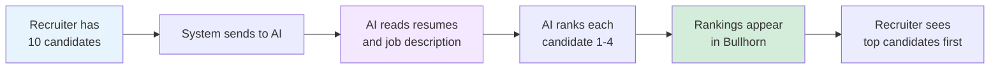
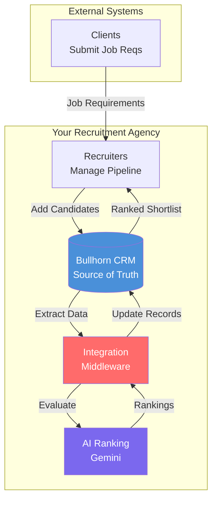
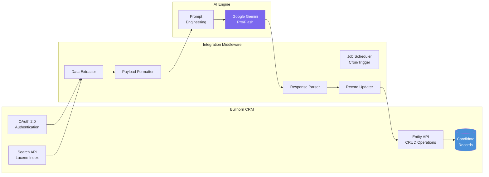
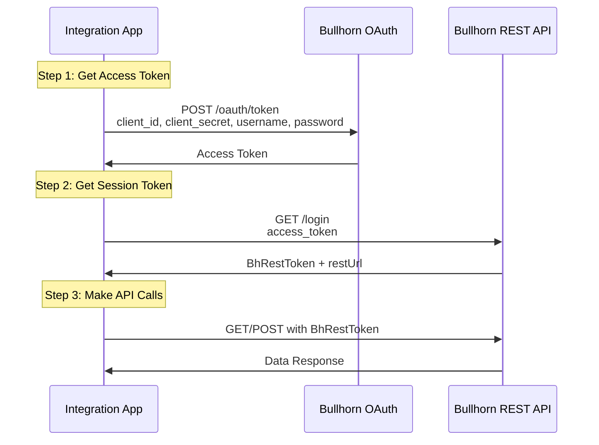
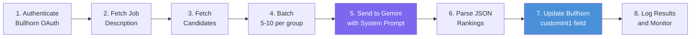

# Bullhorn AI Integration Project

## Executive Summary

This project automates candidate evaluation and ranking using Artificial Intelligence, integrated directly with our Bullhorn CRM system. The goal is to reduce administrative overhead, accelerate time-to-fill, and ensure consistent, data-driven candidate shortlisting.

**Source of Truth:** Bullhorn CRM
**AI Engine:** Google Gemini
**Status:** Phase 1 - Implementation Ready

---

## Business Value

### Current Pain Points
- Recruiters spend hours manually reading and evaluating resumes
- Inconsistent ranking criteria across different recruiters
- Slow response times to client job requirements
- Administrative bottleneck delaying candidate submissions

### Solution Benefits
- **Zero Manual Evaluation:** AI ranks candidates automatically on a 1-4 scale
- **Consistent Standards:** Same evaluation criteria applied to every candidate
- **Instant Shortlisting:** Ranked candidates available immediately in Bullhorn
- **Faster Submissions:** Reduce time-to-fill by eliminating manual review

### Expected ROI
- Save 2-4 hours per job requisition on candidate screening
- Improve submission quality through standardized evaluation
- Enable faster response to client requirements
- Scale recruitment operations without proportional headcount increase

---

## How It Works

**In Simple Terms:**
When a recruiter has a list of candidates for a job, the AI reads each candidate's resume and compares it to the job requirements. It then assigns a ranking from 1 (best match) to 4 (not qualified) and saves this ranking directly into Bullhorn. The recruiter can then immediately see which candidates are the best fit.



### Step-by-Step Process

1. **Trigger:** Recruiter adds candidates to a job order in Bullhorn
2. **Extract:** System automatically pulls candidate data (resume, skills, experience)
3. **Evaluate:** AI compares each candidate to the job description
4. **Rank:** AI assigns a score (1 = Top Tier, 4 = Unqualified)
5. **Store:** Rankings are saved back into Bullhorn automatically
6. **Display:** Recruiter sees ranked list with top candidates highlighted

---

## Ranking Scale


| Rank | Label | Criteria | Action |
|------|-------|----------|--------|
| **1** | Top Tier | Meets ALL required + ALL preferred skills + exceptional experience | Submit immediately |
| **2** | Strong | Meets ALL required + SOME preferred skills | Consider for submission |
| **3** | Average | Meets MOST required but lacks key experience | May need upskilling |
| **4** | Unqualified | Missing critical required skills or insufficient experience | Do not submit |

---

## Architecture

### System Overview



### Component Architecture



| Component | Responsibility | Technology |
|-----------|---------------|------------|
| **Bullhorn OAuth 2.0** | Authenticate and obtain session token | REST API, OAuth 2.0 |
| **Bullhorn Search API** | Query candidates using Lucene syntax | REST API, Lucene |
| **Bullhorn Entity API** | Update candidate records with rankings | REST API, JSON |
| **Job Scheduler** | Trigger integration at scheduled intervals | Cron, AWS EventBridge |
| **Data Extractor** | Pull candidate data from Bullhorn | Node.js |
| **Payload Formatter** | Structure data for LLM consumption | JSON processing |
| **AI Engine** | Evaluate and rank candidates | Google Gemini API |
| **Response Parser** | Extract rankings from LLM response | JSON parsing |
| **Record Updater** | Write rankings back to Bullhorn | REST API calls |

---

## Implementation Guide

### Prerequisites

Before you begin, ensure you have:

- [ ] Bullhorn API credentials (client_id, client_secret, username, password)
- [ ] Identified a custom field in Bullhorn for storing rankings (e.g., `customInt1`)
- [ ] Google AI Studio API key for Gemini
- [ ] Node.js 18+ installed
- [ ] A Bullhorn Job Order ID to test with

### Project Structure

```
bh-ai-integration/
├── src/
│   ├── bullhorn-client.js    # Bullhorn API wrapper
│   ├── gemini-client.js      # Gemini AI integration
│   ├── prompts.js            # System prompt and templates
│   └── index.js              # Entry point
├── config/
│   └── .env.example          # Environment variables template
├── tests/
│   └── test_integration.js   # Test suite
├── package.json
└── README.md
```

### Setup Instructions

#### 1. Clone and Install

```bash
# Create project directory
mkdir bh-ai-integration
cd bh-ai-integration

# Initialize npm
npm init -y

# Install dependencies
npm install axios dotenv @google/generative-ai
```

#### 2. Configure Environment Variables

Create a `.env` file in the project root:

```bash
# Bullhorn CRM Credentials
BH_CLIENT_ID=your_bullhorn_client_id
BH_CLIENT_SECRET=your_bullhorn_client_secret
BH_USERNAME=your_bullhorn_username
BH_PASSWORD=your_bullhorn_password

# Google Gemini API
GEMINI_API_KEY=your_gemini_api_key

# Configuration
RANKING_FIELD=customInt1
BATCH_SIZE=10
JOB_ORDER_ID=12345
```

> **Important:** Never commit `.env` files to version control. Add `.env` to your `.gitignore`.

#### 3. Get Gemini API Key

1. Go to [Google AI Studio](https://aistudio.google.com/)
2. Click "Get API Key" in the left sidebar
3. Create a new API key
4. Copy the key to your `.env` file

#### 4. Identify Bullhorn Custom Field

Contact your Bullhorn administrator to identify which custom field to use for storing rankings. Common options:
- `customInt1` through `customInt30` - for numeric values
- `customText1` through `customText30` - for text values

---

## The AI Prompt

### System Prompt

This prompt defines how the AI evaluates candidates:

```
You are an expert Recruitment Process Consultant and Senior Technical Recruiter with 15+ years of experience in candidate evaluation. Your goal is to critically evaluate candidates against a provided Job Description and rank each candidate on a scale of 1 to 4.

RANKING SCALE:
1 - Top Tier: Exceptional match. Meets all required and preferred skills with outstanding experience.
2 - Strong: Solid match. Meets all required skills and some preferred skills.
3 - Average: Meets most required skills but lacks key experience. May need upskilling.
4 - Unqualified: Does not meet the baseline requirements.

EVALUATION INSTRUCTIONS:
1. Critically analyze each Candidate's resume/description against the Job Description.
2. Be objective, data-driven, and thorough in your evaluation.
3. Consider both technical skills and relevant experience.
4. Be selective - reserve Rank 1 for truly exceptional candidates.
5. Evaluate EVERY candidate in the provided list. Do not skip any.
6. Return the results STRICTLY as a valid JSON array.
7. Do NOT include markdown formatting, conversational text, or explanations outside the JSON structure.

EXPECTED JSON FORMAT:
[
  {
    "candidate_id": 123456,
    "rank": 2,
    "justification": "Brief explanation of the ranking decision"
  }
]
```

### Example Request

**Input:**
```
JOB DESCRIPTION:
Senior Java Developer

REQUIRED SKILLS:
- 5+ years Java development experience
- Strong understanding of Spring Boot framework
- Experience with microservices architecture
- Proficiency in SQL and database design
- Experience with CI/CD pipelines

PREFERRED SKILLS:
- AWS certification or extensive AWS experience
- Experience with Docker and Kubernetes
- Knowledge of message queues (RabbitMQ, Kafka)
- Previous experience in financial services

---

CANDIDATES:
[
  {
    "id": 5059165,
    "firstName": "Alanzo",
    "lastName": "Smith",
    "description": "Senior Java Developer with 7 years of experience in enterprise applications. Extensive experience with Spring Boot, microservices, and AWS. AWS Solutions Architect certified. Led development of distributed systems processing 1M+ transactions/day.",
    "primarySkills": [
      {"name": "Java"},
      {"name": "Spring Boot"},
      {"name": "AWS"},
      {"name": "Docker"},
      {"name": "Kubernetes"}
    ]
  },
  {
    "id": 5059166,
    "firstName": "Janis",
    "lastName": "Williams",
    "description": "Junior developer with 1 year of Python experience. Familiar with Django framework. Recently completed a coding bootcamp.",
    "primarySkills": [
      {"name": "Python"},
      {"name": "Django"}
    ]
  }
]
```

**Output:**
```json
[
  {
    "candidate_id": 5059165,
    "rank": 1,
    "justification": "Exceptional match. Meets all required skills (7 years Java, Spring Boot, microservices, SQL, CI/CD) and all preferred skills (AWS certified, Docker, Kubernetes, financial services experience). Outstanding track record with distributed systems."
  },
  {
    "candidate_id": 5059166,
    "rank": 4,
    "justification": "Does not meet baseline requirements. Only 1 year of experience (requires 5+), primary language is Python not Java, missing Spring Boot, microservices, SQL, and CI/CD experience. Not qualified for this senior Java role."
  }
]
```

### Batch Processing Strategy

When evaluating more than 10 candidates, split them into batches to ensure quality and avoid token limits:

| Total Candidates | Batch Size | Number of Batches |
|------------------|------------|-------------------|
| 1-10 | All at once | 1 |
| 11-30 | 10 per batch | 2-3 |
| 31-50 | 10 per batch | 4-5 |
| 51-100 | 8 per batch | 7-13 |
| 100+ | 5 per batch | 20+ |

---

## Quick API Reference

### Bullhorn Authentication



### Key Endpoints

| Endpoint | Purpose | Method |
|----------|---------|--------|
| `/oauth/token` | Get access token | POST |
| `/rest-services/login` | Get session token (BhRestToken) | GET |
| `/search/Candidate` | Search for candidates | GET |
| `/entity/JobOrder/{id}` | Get job order details | GET |
| `/entity/Candidate/{id}` | Update candidate record | POST |

### Authentication URLs

- **Auth URL:** `https://auth.bullhornstaffing.com/oauth/authorize`
- **Token URL:** `https://auth.bullhornstaffing.com/oauth/token`
- **Login URL:** `https://rest.bullhornstaffing.com/rest-services/login`

For detailed API specifications, see [BULLHORN_API_REFERENCE.md](BULLHORN_API_REFERENCE.md).

---

## Running the Integration

### Development

```bash
# Set environment variables
source .env  # or manually export each variable

# Run the integration
node src/index.js
```

### Production Deployment

#### Option 1: Docker

```dockerfile
FROM node:20-slim

WORKDIR /app
COPY package*.json ./
RUN npm ci --only=production

COPY src/ ./src/

CMD ["node", "src/index.js"]
```

```bash
docker build -t bh-ranking .
docker run --env-file .env bh-ranking
```

#### Option 2: Scheduled Job (Cron)

```cron
# Run ranking every weekday at 8:00 AM
0 8 * * 1-5 cd /app/bh-ai-integration && node src/index.js >> /var/log/bh-ranking.log 2>&1
```

#### Option 3: AWS Lambda

Package the code as a Lambda function and trigger via EventBridge scheduler.

---

## Testing

### Manual Testing Checklist

- [ ] Test authentication with Bullhorn
- [ ] Retrieve job description successfully
- [ ] Search and retrieve candidates
- [ ] Send batch to Gemini and receive valid JSON
- [ ] Update candidate records in Bullhorn
- [ ] Verify rankings appear in Bullhorn UI
- [ ] Test with various candidate counts (1, 10, 25, 50)
- [ ] Test error handling (invalid credentials, rate limits)

### Test with Sample Data

Before running on real candidates, test with a small job order (3-5 candidates) and compare AI rankings against your own manual evaluation.

---

## Error Handling

| Error Code | Meaning | Recovery Action |
|------------|---------|-----------------|
| **401** | Session expired | Re-authenticate with OAuth 2.0 |
| **429** | Rate limit exceeded | Wait 60s, then retry with exponential backoff |
| **500** | Bullhorn server error | Retry with backoff, max 3 attempts |
| **400** | Bad request (invalid JSON) | Log and skip, fix payload structure |
| **404** | Candidate not found | Log and skip, candidate may be deleted |

---

## Monitoring

### Key Metrics to Track

| Metric | Target | Alert Threshold |
|--------|--------|-----------------|
| API Response Time | < 2 seconds | > 10 seconds |
| Success Rate | > 98% | < 95% |
| Candidates Processed/Hour | Varies | N/A |
| Authentication Failures | 0 | > 3 consecutive |
| Gemini Token Usage | Track cost | Budget limit |

### Logging

Log the following for each run:
- Start/end timestamps
- Number of candidates processed
- Success/failure count
- Any errors encountered
- Gemini token usage

---

## Phase 2: Future Integration

After Phase 1 is stable, Phase 2 will add SAP Fieldglass integration:

- Auto-submit Rank 1 candidates to Fieldglass
- Sync job requisitions from Fieldglass to Bullhorn
- Two-way data synchronization
- End-to-end automation from requisition to submission

See [FUTURE_STATE_FIELDGLASS_INTEGRATION.md](FUTURE_STATE_FIELDGLASS_INTEGRATION.md) for details.

---

## Quick Reference Card



| Item | Value |
|------|-------|
| Bullhorn token endpoint | `https://auth.bullhornstaffing.com/oauth/token` |
| Bullhorn login endpoint | `https://rest.bullhornstaffing.com/rest-services/login` |
| Ranking field | `customInt1` (or your designated field) |
| Batch size | 5-10 candidates |
| Gemini model | `gemini-1.5-flash` or `gemini-1.5-pro` |
| Temperature | 0.1-0.3 |
| Token lifetime | ~8-10 hours |

---

## Troubleshooting

### Common Issues

**"Authentication failed"**
- Verify your Bullhorn credentials are correct
- Check that your Bullhorn account has API access enabled
- Ensure you're using the correct OAuth endpoints

**"No candidates found"**
- Verify the Job Order ID exists
- Check that candidates are associated with the job order
- Ensure your Bullhorn user has permission to view candidates

**"Gemini returns invalid JSON"**
- The prompt includes strict JSON formatting instructions
- Check the Gemini response for markdown code blocks and strip them
- Add response validation in your parsing code

**"Rankings not appearing in Bullhorn"**
- Verify the custom field name is correct
- Check your Bullhorn user has write permissions
- Ensure the field is visible in your Bullhorn layout

---

## Support

For detailed API documentation, see:
- [BULLHORN_API_REFERENCE.md](BULLHORN_API_REFERENCE.md) - Detailed Bullhorn API specs
- [FUTURE_STATE_FIELDGLASS_INTEGRATION.md](FUTURE_STATE_FIELDGLASS_INTEGRATION.md) - Phase 2 roadmap
