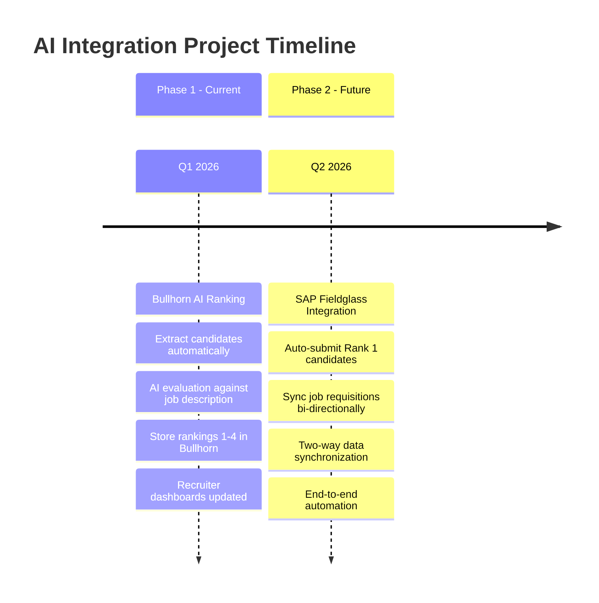
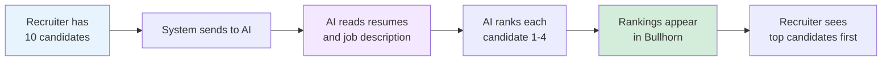
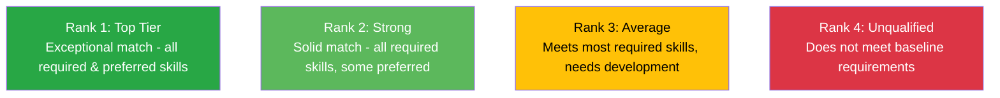
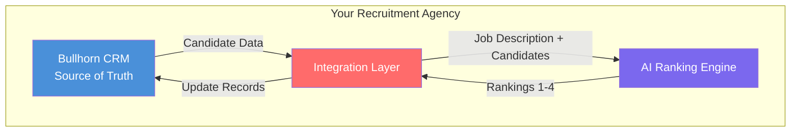
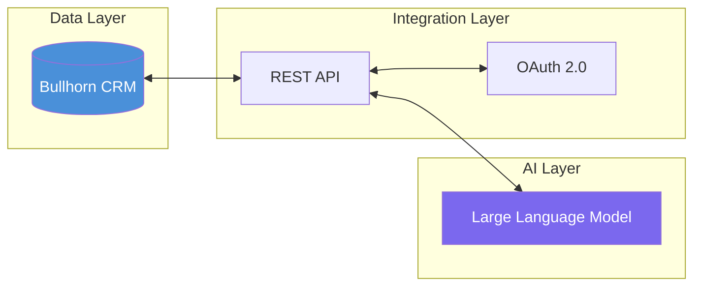
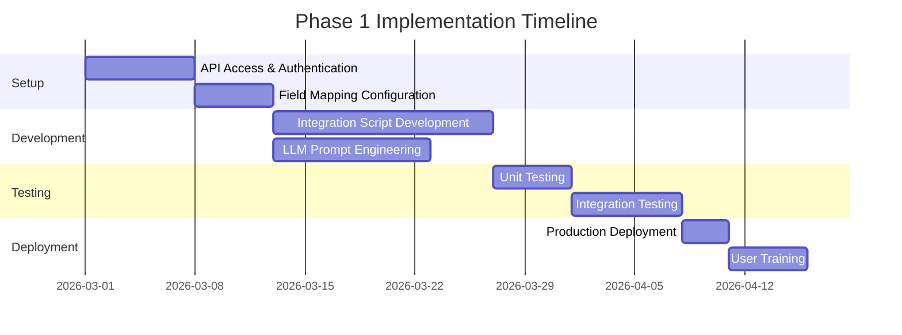

# Bullhorn AI Integration Project

## Executive Summary

This project automates candidate evaluation and ranking using Artificial Intelligence, integrated directly with our Bullhorn CRM system. The goal is to reduce administrative overhead, accelerate time-to-fill, and ensure consistent, data-driven candidate shortlisting.

**Source of Truth:** Bullhorn CRM  
**AI Engine:** Large Language Model (LLM) integration  
**Status:** Phase 1 - Implementation Ready

---

## Business Value

### Current Pain Points
- Recruiters spend hours manually reading and evaluating resumes
- Inconsistent ranking criteria across different recruiters
- Slow response times to client job requirements
- Administrative bottleneck delaying candidate submissions

### Solution Benefits
- **Zero Manual Evaluation:** AI ranks candidates automatically on a 1-4 scale
- **Consistent Standards:** Same evaluation criteria applied to every candidate
- **Instant Shortlisting:** Ranked candidates available immediately in Bullhorn
- **Faster Submissions:** Reduce time-to-fill by eliminating manual review

### Expected ROI
- Save 2-4 hours per job requisition on candidate screening
- Improve submission quality through standardized evaluation
- Enable faster response to client requirements
- Scale recruitment operations without proportional headcount increase

---

## Project Phases

---

## System Overview

### What Does This System Do?

**In Simple Terms:**
When a recruiter has a list of candidates for a job, the AI reads each candidate's resume and compares it to the job requirements. It then assigns a ranking from 1 (best match) to 4 (not qualified) and saves this ranking directly into Bullhorn. The recruiter can then immediately see which candidates are the best fit.

### How It Works (Non-Technical)

1. **Trigger:** Recruiter adds candidates to a job order in Bullhorn
2. **Extract:** System automatically pulls candidate data (resume, skills, experience)
3. **Evaluate:** AI compares each candidate to the job description
4. **Rank:** AI assigns a score (1 = Top Tier, 4 = Unqualified)
5. **Store:** Rankings are saved back into Bullhorn automatically
6. **Display:** Recruiter sees ranked list with top candidates highlighted

---

## Ranking Scale Explained

---

## Architecture at a Glance

---

## Documentation Suite

This project includes comprehensive documentation for both technical and non-technical stakeholders:

| Document | Purpose | Audience |
|----------|---------|----------|
| **README.md** (this file) | Executive overview and project summary | All stakeholders |
| **ARCHITECTURE_AND_WORKFLOW.md** | System design and data flows | Technical leads, managers |
| **BULLHORN_IMPLEMENTATION_SPEC.md** | API specifications and integration details | Developers |
| **LLM_PROMPT_ENGINEERING.md** | AI prompt design and evaluation criteria | Developers, AI specialists |
| **FUTURE_STATE_FIELDGLASS_INTEGRATION.md** | Phase 2 roadmap and Fieldglass sync | Technical leads, managers |
| **INTEGRATION_PROMPT.md** | Ready-to-use AI prompt with code examples | Developers |

---

## Technology Stack

**Components:**
- **Bullhorn REST API:** Data extraction and update endpoints
- **OAuth 2.0:** Secure authentication with Bullhorn
- **LLM Integration:** AI-powered candidate evaluation
- **Custom Middleware:** Orchestration and data transformation

---

## Implementation Timeline

### Phase 1: Bullhorn AI Ranking (Current)

### Phase 2: Fieldglass Integration (Future)

- Auto-submit Rank 1 candidates to Fieldglass
- Sync job requisitions from Fieldglass to Bullhorn
- Two-way data synchronization
- SAP Developer Dashboard configuration required

---

## Key Success Metrics

| Metric | Current State | Target (Post-Implementation) |
|--------|--------------|------------------------------|
| Time to shortlist candidates | 2-4 hours | < 5 minutes |
| Evaluation consistency | Variable by recruiter | 100% standardized |
| Submission speed | 1-2 days | Same day |
| Recruiter admin time | 40% of day | 15% of day |

---

## Next Steps

1. **Review Documentation:** Read through the technical specifications
2. **API Access:** Ensure Bullhorn API credentials are available
3. **Field Mapping:** Identify custom field in Bullhorn for rankings (e.g., `customInt1`)
4. **Development:** Begin integration script development
5. **Testing:** Validate with sample job requisitions
6. **Deployment:** Roll out to production environment

---

## Contact & Support

For questions about this integration:
- **Technical Implementation:** See `BULLHORN_IMPLEMENTATION_SPEC.md`
- **AI Prompt Design:** See `LLM_PROMPT_ENGINEERING.md`
- **Architecture Details:** See `ARCHITECTURE_AND_WORKFLOW.md`
- **Future Roadmap:** See `FUTURE_STATE_FIELDGLASS_INTEGRATION.md`

---

## Quick Reference: Ranking Scale

| Rank | Label | Description | Action |
|------|-------|-------------|--------|
| **1** | Top Tier | Exceptional match - meets all required and preferred skills | Submit immediately |
| **2** | Strong | Solid match - meets all required skills and some preferred | Consider for submission |
| **3** | Average | Meets most required skills but lacks key experience | May need upskilling |
| **4** | Unqualified | Does not meet baseline requirements | Do not submit |
