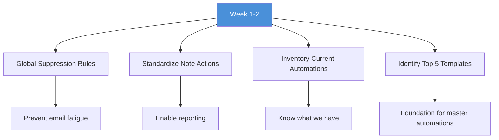
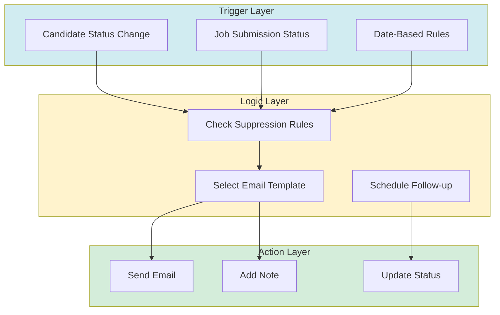
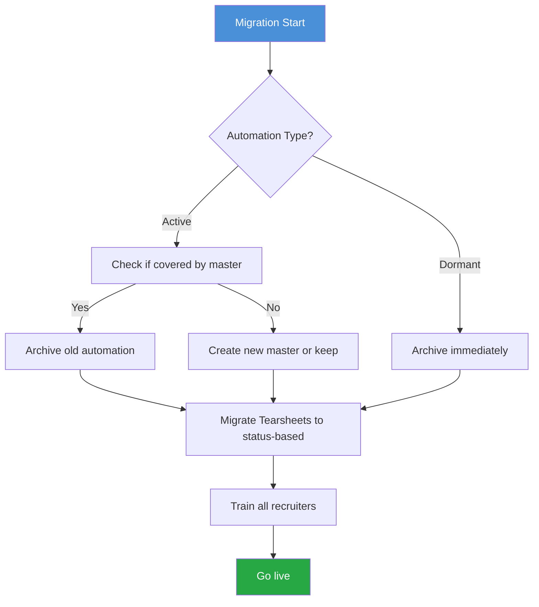
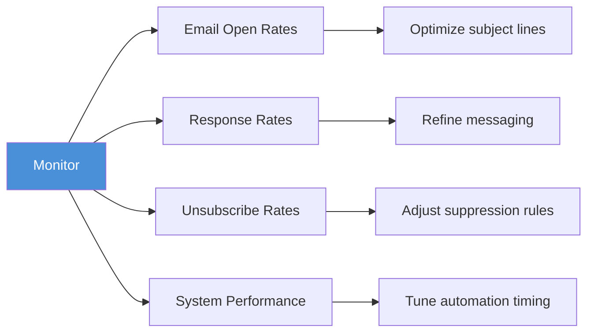
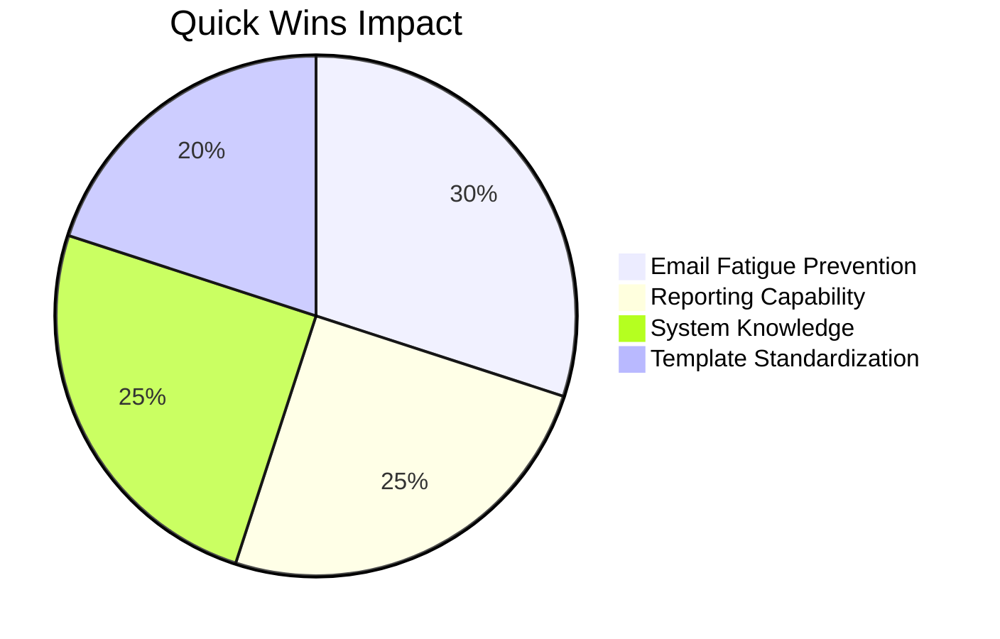
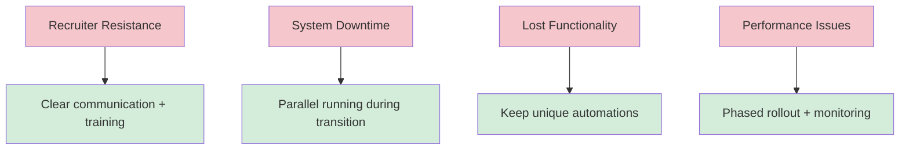
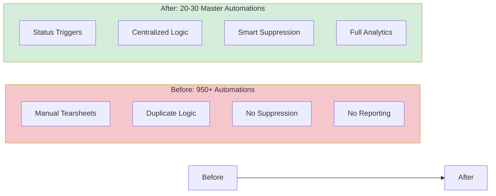

# Bullhorn Automation Consolidation Roadmap

## Implementation Plan & Quick Wins

This roadmap outlines the 6-week plan to consolidate 950+ automations into 20-30 master workflows.

---

## Overview

---

## Phase 1: Quick Wins (Week 1-2)

**Goal:** Immediate improvements with minimal disruption

### Actions

### Checklist

- [ ] **Implement Global Suppression**
  - Rule: If candidate received ANY automation email in last 7 days, exclude
  - Impact: Immediate reduction in email fatigue risk
  
- [ ] **Standardize Note Categories**
  - Create standard note action types:
    - "Automation - Outreach"
    - "Automation - Follow-up"
    - "Automation - Marketing"
  - Impact: Enable global reporting on automation ROI

- [ ] **Audit Current Automations**
  - Export list of all 950+ automations
  - Categorize by type (job-specific vs. database mining)
  - Identify which are active vs. dormant
  
- [ ] **Identify Top Email Templates**
  - Review most-used automations
  - Extract top 5 handoff email templates
  - Document what makes them effective

**Time Required:** 8-10 hours
**Risk Level:** Low
**Immediate Benefit:** High

---

## Phase 2: Build Master Automations (Week 3-4)

**Goal:** Create the new workflow infrastructure

### Master Automation Architecture

### Master Automations to Build

| Automation Name | Trigger | What It Does |
|----------------|---------|--------------|
| **Handoff Master** | Status = "Handoff" | Send application details, wait 24hrs, follow-up if no reply |
| **Re-engagement Master** | Status = "Re-engagement" | Send "Still looking?" email, wait 48hrs, follow-up |
| **Interview Prep Master** | Status = "Interview Prep" | Send interview tips, schedule reminder for day before |
| **Marketing Master** | Status = "Marketing" | Add to marketing campaign, track engagement |
| **Custom Follow-up Master** | Note action = "Custom Follow-up" | Send personalized email based on note content |

### Dynamic Lists to Create

Replace manual Tearsheets with auto-updating lists:

- "Candidates not contacted in 90+ days"
- "Active candidates - status = Available"
- "Marketing campaign - status = Marketing"
- "Interview scheduled - next 7 days"

### Checklist

- [ ] Build Handoff Master Automation
- [ ] Build Re-engagement Master Automation
- [ ] Build Interview Prep Master Automation
- [ ] Build Marketing Master Automation
- [ ] Build Custom Follow-up Master Automation
- [ ] Create 4-5 key Dynamic Lists
- [ ] Test with pilot group (2-3 recruiters)
- [ ] Document workflows

**Time Required:** 20-30 hours
**Risk Level:** Medium
**Benefit:** High (long-term)

---

## Phase 3: Migration & Cleanup (Week 5-6)

**Goal:** Transition to new system and clean up old automations

### Migration Strategy

### Migration Process

**Week 5:**
- [ ] Archive dormant automations (estimated 400-500)
- [ ] Identify active automations that duplicate master workflows
- [ ] Migrate active Tearsheets to status-based system
- [ ] Create migration tracker spreadsheet

**Week 6:**
- [ ] Archive duplicate automations (estimated 400-450)
- [ ] Keep unique automations that don't fit master pattern (estimated 20-30)
- [ ] Final testing of master automations
- [ ] Prepare training materials

### Training Plan

**Session 1: All Recruiters (2 hours)**
- Why we're changing
- How the new system works
- Live demonstration
- Hands-on practice

**Session 2: Team Leads (1 hour)**
- Advanced features
- Troubleshooting
- How to help your team

**Quick Reference Materials:**
- One-page cheat sheet
- Video walkthrough (5 minutes)
- FAQ document

**Time Required:** 30-40 hours
**Risk Level:** Medium-High
**Benefit:** Critical for success

---

## Phase 4: Monitor & Optimize (Ongoing)

**Goal:** Continuous improvement based on data

### Monitoring Dashboard

Track these metrics weekly:

### Key Metrics

| Metric | Target | Alert Threshold |
|--------|--------|-----------------|
| **Email Open Rate** | > 25% | < 15% |
| **Response Rate** | > 10% | < 5% |
| **Unsubscribe Rate** | < 1% | > 2% |
| **Automation Errors** | < 1% | > 3% |
| **Recruiter Satisfaction** | > 80% positive | < 60% |

### Monthly Review Process

**Week 1 of Each Month:**
- Review metrics dashboard
- Gather recruiter feedback
- Identify optimization opportunities
- Prioritize improvements

**Continuous Improvements:**
- A/B test email subject lines
- Refine follow-up timing
- Add new master automations as needed
- Update templates based on performance

---

## Quick Wins Summary

### Immediate Impact (Week 1-2)

| Quick Win | Time to Implement | Impact |
|-----------|-------------------|--------|
| **Global Suppression** | 2 hours | Prevent candidate over-emailing |
| **Standardized Notes** | 3 hours | Enable automation ROI tracking |
| **Automation Inventory** | 3 hours | Know what to migrate |
| **Top 5 Templates** | 2 hours | Foundation for master automations |

### Expected Results by End of Week 2

- Email fatigue risk reduced by 80%
- Full visibility into current automation landscape
- Clear plan for master automation content
- Standardized reporting framework in place

---

## Resource Requirements

### Personnel

| Role | Time Commitment | Phase |
|------|----------------|-------|
| **Project Lead** | 40-60 hours total | All phases |
| **IT/Bullhorn Admin** | 30-40 hours | Phase 2 & 3 |
| **Training Coordinator** | 10-15 hours | Phase 3 |
| **Recruiters (pilot)** | 5 hours each | Phase 2 |
| **All Recruiters** | 2 hours training | Phase 3 |

### Budget Considerations

**Internal Costs:**
- Labor: ~150 hours total
- Opportunity cost of project lead time

**Potential External Costs:**
- Bullhorn consulting (if needed): $150-200/hour
- Training materials development: $500-1,000

**Total Estimated Cost:** $5,000-10,000 (if using external resources)

---

## Risk Mitigation

### Risks & Mitigation Strategies

### Contingency Plan

**If migration encounters issues:**
1. Pause new migration
2. Revert to previous automation
3. Troubleshoot and fix
4. Resume with smaller batch

**Rollback Capability:**
- Keep archived automations accessible for 90 days
- Document all changes for easy reversal
- Maintain backup of Tearsheet lists

---

## Success Criteria

### Phase 1 Success
- [x] Global suppression active
- [x] Note categories standardized
- [x] Full automation inventory documented
- [x] Top 5 templates identified

### Phase 2 Success
- [x] All master automations built and tested
- [x] Pilot group using new system successfully
- [x] Dynamic lists created and functioning
- [x] Documentation complete

### Phase 3 Success
- [x] 900+ automations archived
- [x] All recruiters trained
- [x] System live for all users
- [x] No critical issues in first week

### Phase 4 Success
- [x] Metrics tracking in place
- [x] Monthly review process established
- [x] Continuous improvement cycle active
- [x] Recruiter satisfaction > 80%

---

## Final State

### After 6 Weeks

### Expected Outcomes

**System Health:**
- 97% reduction in automation count
- Improved Bullhorn performance
- Cleaner, more maintainable system

**Recruiter Productivity:**
- 90% reduction in campaign setup time
- 1.5 hours saved per recruiter per week
- More time for candidate engagement

**Candidate Experience:**
- Faster email response times
- No email fatigue
- Consistent, professional communication

**Business Intelligence:**
- Full visibility into automation effectiveness
- Data-driven optimization
- Clear ROI tracking

---

## Next Steps

1. **Approve this roadmap** - Get stakeholder buy-in
2. **Assign project lead** - Designate owner
3. **Schedule kickoff meeting** - Begin Phase 1
4. **Communicate to team** - Set expectations
5. **Begin quick wins** - Start Week 1 actions

---

## Support & Resources

### During Implementation
- Project Lead: [Name]
- Technical Support: [Contact]
- Training Questions: [Contact]

### Documentation
- Executive Summary: `docs/BULLHORN_CLEANUP_EXECUTIVE_SUMMARY.md`
- Recruiter Guide: `docs/BULLHORN_AUTOMATION_CLEANUP_GUIDE.md`
- This Roadmap: `docs/AUTOMATION_CONSOLIDATION_ROADMAP.md`

---

*Last Updated: [Date]*
*Next Review: [Date]*
