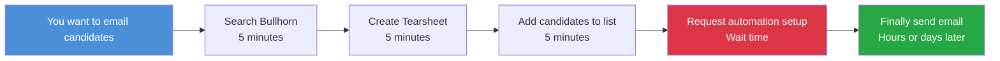
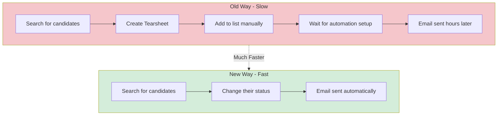
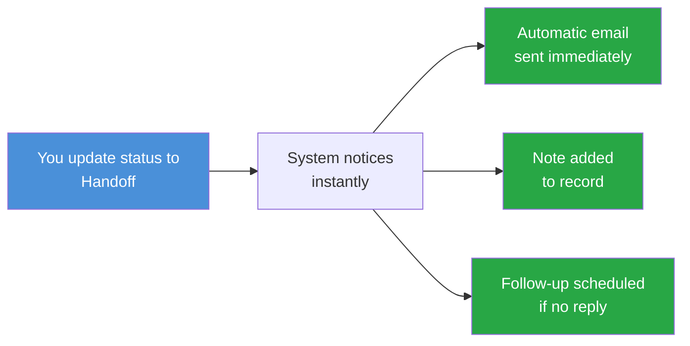
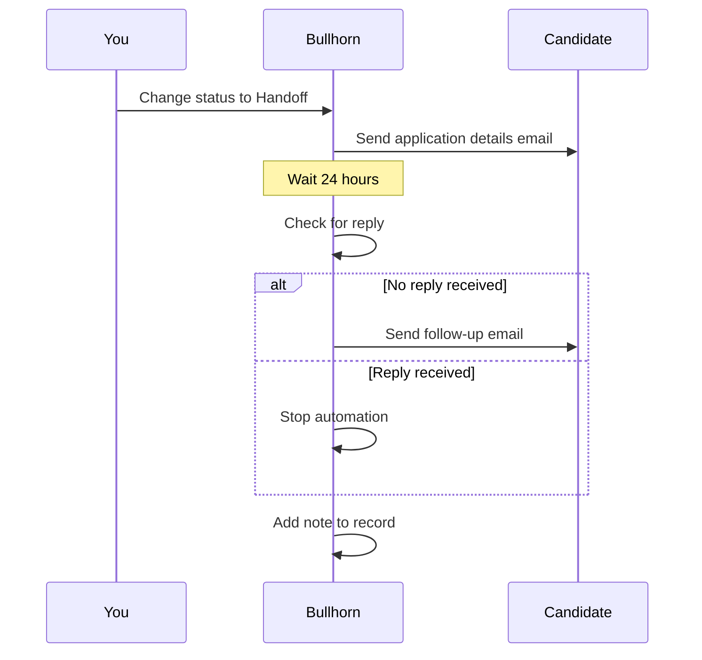
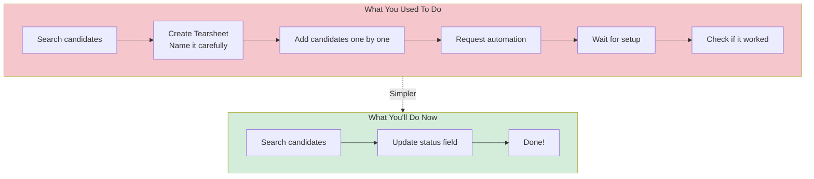
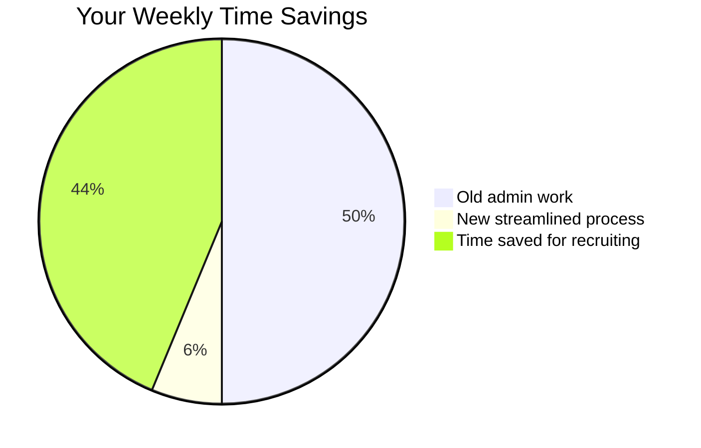
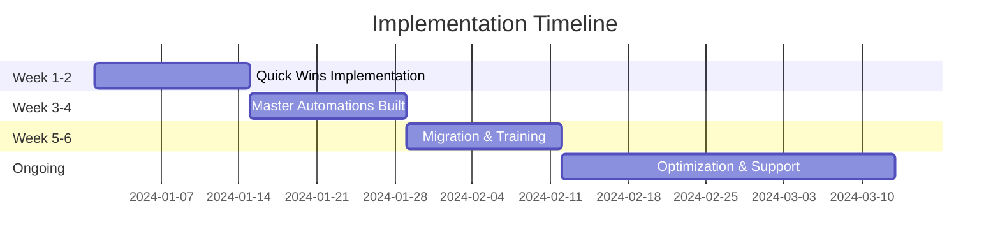

# Bullhorn Automation Cleanup - Recruiter Guide

## What You Need to Know About the Changes

This guide explains how we're making your job easier by fixing our Bullhorn automation system. No technical jargon - just what you need to do your job better.

---

## The Problem: Why We're Making Changes

Right now, we have **over 950 automations** in Bullhorn. Every time you want to send an email campaign, you have to:

1. Search for candidates
2. Create a new Tearsheet (list)
3. Add candidates to that list
4. Ask someone to duplicate an old automation
5. Wait for it to be set up
6. Hope it works

**This is slow, frustrating, and wastes your time.**

### What's Wrong With the Current Way



**The issues:**
- Too many steps
- Too much waiting
- Too much manual work
- Easy to make mistakes
- Hard to track what works

---

## The Solution: A Better Way

We're switching from **manual lists** to **automatic triggers**. Here's what that means for you:

### Before vs After



### The Key Difference

**Old Way**: You create a list → System sends email to that list
**New Way**: You change a status → System automatically sends the right email

**Result**: What used to take 20-30 minutes now takes 2-3 minutes.

---

## How the New System Works

### Status-Based Triggers

Instead of creating lists, you'll use **candidate statuses** to trigger emails automatically.



### Example: Handoff Process

**What you do now:**
1. Find candidates for a job
2. Create a Tearsheet called "Job ABC - Handoff"
3. Add candidates to that list
4. Request automation setup
5. Wait for email to go out

**What you'll do in the new system:**
1. Find candidates for a job
2. Change their status to "Handoff"
3. Done - email goes out automatically

### What Happens Automatically

When you change a candidate's status to "Handoff":



---

## What Changes for You

### Day-to-Day Differences



### Specific Changes

**STOP Doing This:**
- Creating new Tearsheets for every email campaign
- Manually adding candidates to lists
- Waiting for automation setup
- Duplicating old automations

**START Doing This:**
- Using status fields to trigger emails
- Trusting the system to send the right message
- Focusing on candidate conversations instead of admin work

---

## Common Scenarios

### Scenario 1: Sending Handoff Emails

**Old Way (20-30 minutes):**
```
1. Search for qualified candidates
2. Create Tearsheet "Job Title - Handoff - Date"
3. Add 15 candidates to the list
4. Email IT to duplicate automation #847
5. Wait 2 hours for setup
6. Test to make sure it works
7. Fix issues and try again
```

**New Way (2-3 minutes):**
```
1. Search for qualified candidates
2. Select all 15 candidates
3. Bulk update status to "Handoff"
4. Done - emails go out immediately
```

### Scenario 2: Re-engaging Old Candidates

**Old Way:**
```
1. Search for candidates not contacted in 90 days
2. Create Tearsheet "Re-engagement Campaign - Q1"
3. Add 50 candidates
4. Request new automation
5. Customize email template
6. Wait for approval and setup
```

**New Way:**
```
1. Search for candidates not contacted in 90 days
2. Bulk update status to "Re-engagement"
3. System automatically sends re-engagement email
4. Follow-up scheduled if no reply
```

### Scenario 3: Custom Email After a Call

**Old Way:**
```
1. Have great call with candidate
2. Want to send personalized follow-up
3. Can't use automation - too generic
4. Send manual email instead
5. No tracking or follow-up
```

**New Way:**
```
1. Have great call with candidate
2. Add note with action "Custom Follow-up"
3. System triggers custom email flow
4. Pulls details from your note
5. Automatic tracking and follow-up
```

---

## Benefits for You

### Time Savings



**Per Week:**
- Old process: ~5 hours on automation setup and list management
- New process: ~30 minutes on status updates
- **Time saved: 4.5 hours per week**

**That's an extra 4.5 hours to:**
- Call candidates
- Build relationships
- Close deals
- Actually recruit

### Better Candidate Experience

**Before:**
- Candidates wait hours/days for emails
- Possible duplicate emails from different lists
- Inconsistent messaging
- No automatic follow-up

**After:**
- Instant email response
- Intelligent suppression prevents over-emailing
- Consistent, professional messaging
- Automatic follow-up if no reply

### Less Stress

**No More:**
- "Did that automation work?"
- "Why didn't the email go out?"
- "I need to create another Tearsheet..."
- "Wait, which list were they on?"

**Just:**
- Update status
- Move on with your day
- Trust the system

---

## What You Need to Learn

### New Status Values

You'll use specific status values to trigger different email campaigns:

| Status | What It Triggers | When to Use |
|--------|------------------|-------------|
| **Handoff** | Application details email + follow-up | When candidate is ready for client submission |
| **Re-engagement** | "Still looking?" email + follow-up | Reconnecting with old candidates |
| **Marketing** | General marketing content | Adding to marketing campaigns |
| **Interview Prep** | Interview tips and resources | Before client interviews |
| **Custom Follow-up** | Personalized email based on your note | After phone calls |

### How to Update Status

**Individual Candidate:**
1. Open candidate record
2. Find status field
3. Select new status from dropdown
4. Save

**Multiple Candidates (Bulk):**
1. Search and select candidates
2. Click "Bulk Edit"
3. Choose status field
4. Select new status
5. Save all

### Adding Notes for Custom Emails

For personalized emails after calls:

1. Open candidate record
2. Add new note
3. Select action type: "Custom Follow-up"
4. Write your key points in the note
5. System uses this to personalize the email

---

## FAQ

### "What if I need to send a custom email?"

**Answer:** Use the "Custom Follow-up" note action. Write your key points in the note, and the system will incorporate them into a personalized email.

### "What if the candidate already got an email recently?"

**Answer:** The system automatically checks. If they received an automation email in the last 7 days, they won't get another one. This prevents email fatigue.

### "Can I still create Tearsheets for myself?"

**Answer:** Yes! You can still create personal Tearsheets for organization. They just won't be used to trigger automations anymore.

### "What if I make a mistake and update the wrong status?"

**Answer:** Just change it back. The system will stop the automation and not send the email.

### "Will I still be able to see what emails were sent?"

**Answer:** Yes! Every automated email is logged in the candidate's activity record, just like before.

### "What about the 950 old automations?"

**Answer:** They'll be gradually cleaned up and archived. You don't need to worry about them - just use the new status-based system.

### "Do I need to remember complex automation names?"

**Answer:** No! Just remember the status values. The system handles the rest.

---

## Tips for Success

### DO:
- Use the right status for the right situation
- Trust the system to send emails
- Check candidate records to see what was sent
- Add meaningful notes for custom follow-ups
- Ask if you're unsure which status to use

### DON'T:
- Create new Tearsheets for email campaigns
- Try to duplicate old automations
- Worry about technical setup
- Manually send emails that should be automated
- Hesitate to ask for help

---

## Getting Help

### Training Sessions

We'll run 2-hour training sessions to show you:
- How to use the new status fields
- How to bulk update candidates
- How to add custom follow-up notes
- How to check what emails were sent

### Quick Reference Guide

You'll get a one-page cheat sheet with:
- Status values and when to use them
- Step-by-step instructions
- Screenshots of the process
- Who to contact for help

### Support

**Questions?**
- Talk to your team lead
- Email: [support email]
- Check the shared documentation

**Problems?**
- Report issues immediately
- We can quickly adjust automations
- Your feedback makes the system better

---

## Timeline: When Does This Happen?



**Week 1-2:** System setup (you won't notice changes yet)
**Week 3-4:** Testing with pilot group
**Week 5:** Training sessions for everyone
**Week 6:** Go live with new system
**Ongoing:** Support and improvements

---

## What Success Looks Like

### For You:
- Less time on admin work
- More time for candidate calls
- Fewer "did the email go out?" questions
- Confidence that the right message goes at the right time

### For Candidates:
- Faster response times
- No email overload
- Consistent, professional communication
- Better experience with our agency

### For the Agency:
- Cleaner Bullhorn system
- Better reporting on what works
- Scalable processes for growth
- Data-driven improvements

---

## Final Thoughts

This change is about making your job easier. The new system:

- **Saves you time** - 4.5 hours per week
- **Reduces frustration** - No more waiting for automation setup
- **Improves results** - Better candidate experience
- **Lets you focus** - On recruiting, not admin work

**Your job is to build relationships and place candidates.**
**Our job is to make the technology support that.**

---

## Quick Reference Card

Cut this out and keep it at your desk:

```
NEW PROCESS - 3 STEPS:
1. Find candidates
2. Update status
3. Done!

STATUS OPTIONS:
• Handoff → Application details email
• Re-engagement → "Still looking?" email
• Marketing → Marketing content
• Interview Prep → Interview resources
• Custom Follow-up → Personalized email

NEED HELP?
• Team lead: [Name]
• Email: [support]
• Training: [Date/Time]

REMEMBER:
No more Tearsheets for emails
No more waiting for setup
Just update status and go!
```

---

*This guide will be updated as we implement the new system. Check for the latest version in the shared drive.*
