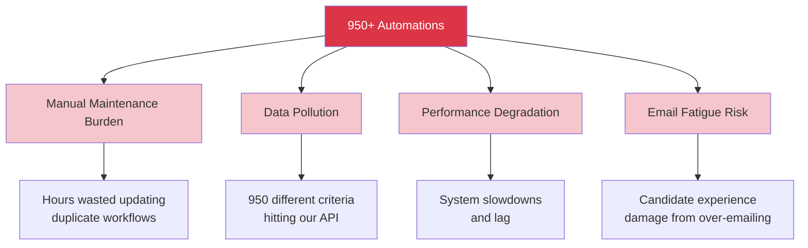
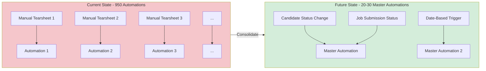
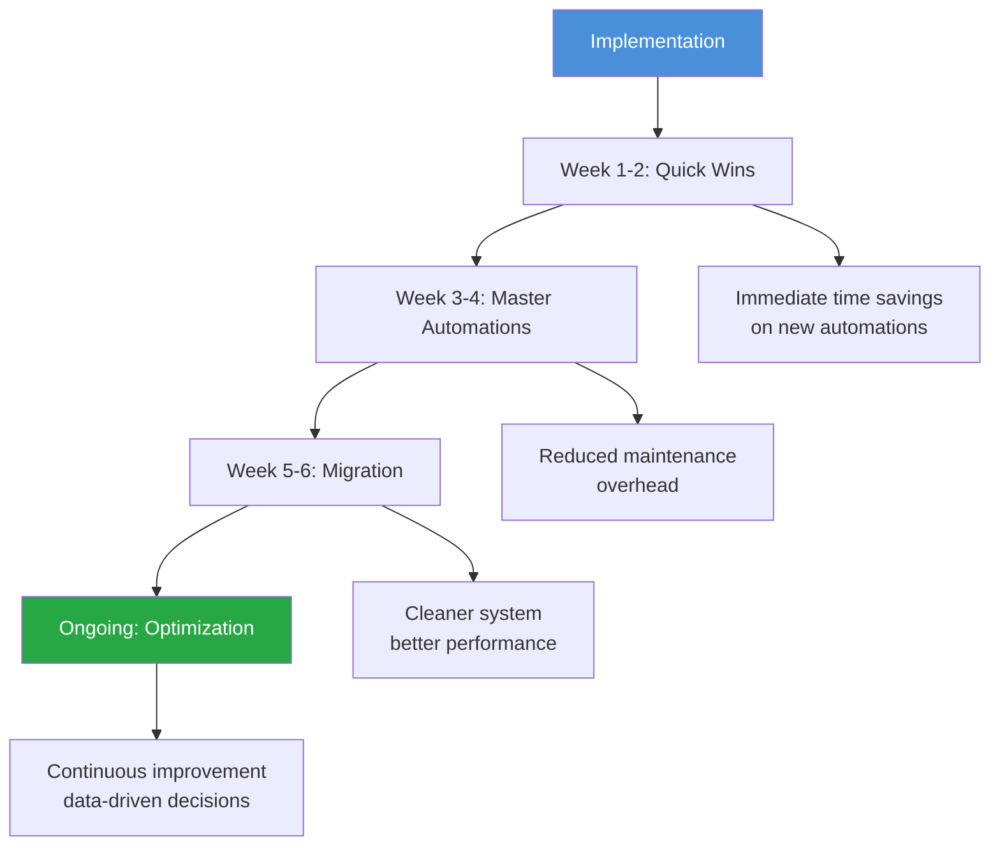
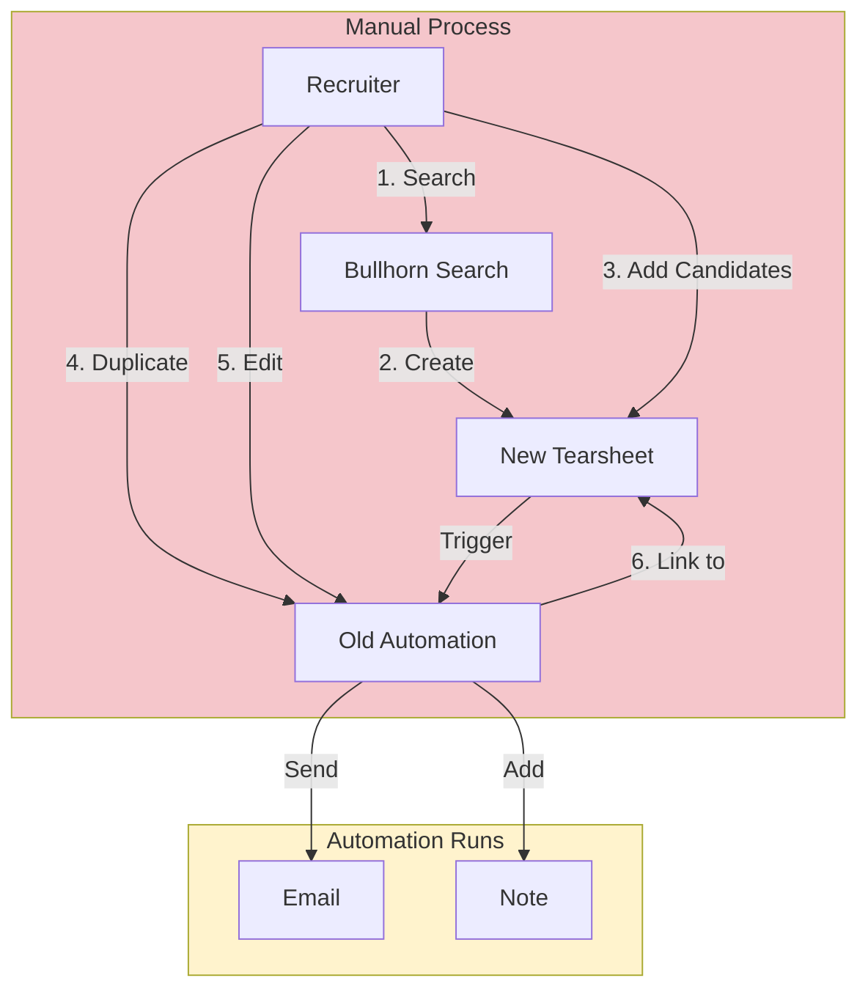
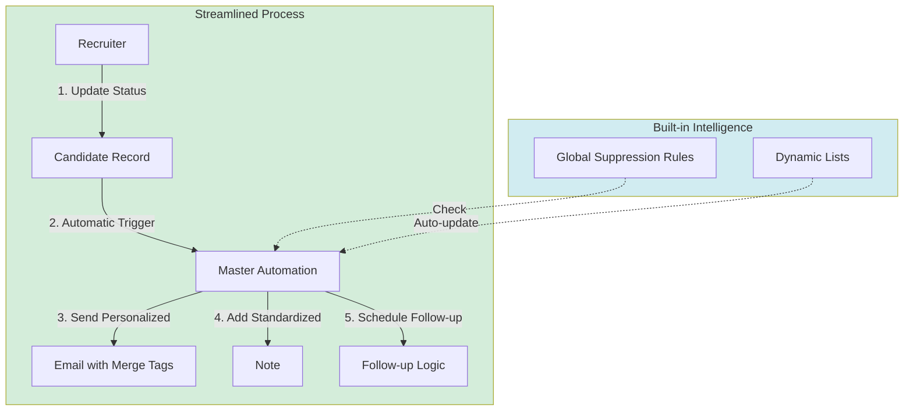

# Bullhorn Automation Cleanup - Executive Summary

## Strategic Overview for Management

This document outlines the critical need to consolidate and optimize our Bullhorn automation system, reducing complexity while improving recruiter productivity and candidate experience.

---

## The Problem: Automation Sprawl

Our current Bullhorn automation system has grown to **950+ individual automations**, creating significant operational inefficiencies and business risks.

### Key Issues

### Root Cause Analysis

**Current Process (Inefficient):**
- Recruiters manually create a new Tearsheet (candidate list) for each outreach campaign
- Staff duplicate the last automation and modify it for the new list
- Each automation follows the same pattern: Get Candidates → Send Email → Add Note
- Result: 950+ separate automations doing essentially the same work

**Why This is Unsustainable:**
1. **Hard-Coded Logic**: Each automation is static. If we need to update our email signature or disclaimer, we must edit 950+ automations
2. **Tearsheet Dependency**: Manual list creation defeats the purpose of automation - it's a manual process with an automated email attached
3. **No Scalability**: Every new job requires creating a new automation, perpetuating the problem
4. **Audit Impossibility**: With 950+ automations, we cannot effectively track ROI or identify which workflows are effective

---

## Business Impact

### Quantified Costs

| Impact Area | Current Cost | Business Risk |
|-------------|--------------|---------------|
| **Recruiter Time** | 15-30 minutes per automation setup | Opportunity cost: Less time for candidate engagement |
| **Maintenance Overhead** | Hours to update templates across 950+ automations | Slow response to compliance/legal changes |
| **System Performance** | 950+ API queries running simultaneously | Bullhorn lag affecting all users |
| **Candidate Experience** | Risk of multiple automated emails in short timeframe | Brand damage and unsubscribe rates |
| **Reporting Accuracy** | Cannot track automation effectiveness | No data-driven decision making |

### Strategic Risk

**Email Fatigue**: Without global suppression rules, candidates may receive multiple automated emails from different workflows within days, damaging our employer brand and candidate relationships.

**Compliance Risk**: Hard-coded content in 950+ automations makes it nearly impossible to ensure all communications comply with updated regulations or company policies.

**Competitive Disadvantage**: While competitors leverage intelligent, data-driven automation, our team spends time on manual list management rather than candidate relationship building.

---

## The Solution: Consolidation Strategy

### Architectural Shift

We will transition from **List-Based Triggers** to **Status-Based Triggers**, consolidating 950+ individual automations into **20-30 Master Automations**.

### Key Components

#### 1. Status-Based Triggers
Replace manual Tearsheets with automatic triggers based on candidate or job submission status changes.

**Example**: When a candidate is moved to "Handoff" status on any job, the system automatically:
- Sends application details email
- Waits 24 hours
- Checks for reply
- Sends follow-up if no response

#### 2. Master Automations
Create standardized workflows that apply across all jobs, using dynamic content (merge tags) to personalize communications.

**Benefits**:
- One update applies to all jobs
- Consistent branding and messaging
- Easy to track and measure effectiveness

#### 3. Global Suppression Rules
Implement system-wide rules to prevent email fatigue:
- "If candidate received ANY automation email in last 7 days, exclude from active flows"
- Centralized control over communication frequency

#### 4. Dynamic Lists
Replace manual Tearsheets with automated lists that update based on criteria:
- "All candidates with status = Marketing"
- "Candidates not contacted in 90+ days"
- "Candidates matching job requirements"

---

## Expected ROI

### Efficiency Gains

### Quantified Benefits

| Metric | Current State | Future State | Savings |
|--------|---------------|--------------|---------|
| **Automation Count** | 950+ | 20-30 | 97% reduction |
| **Setup Time per Campaign** | 15-30 minutes | 2-3 minutes | 90% reduction |
| **Template Updates** | Update 950+ automations | Update 1 master automation | 99% reduction |
| **Email Fatigue Risk** | High (no global rules) | Low (centralized control) | Risk mitigation |
| **Reporting Capability** | Manual/Impossible | Automated dashboards | Real-time visibility |
| **System Performance** | Degraded (950+ queries) | Optimized (20-30 queries) | Improved for all users |

### Time Savings Calculation

**Per Recruiter, Per Week:**
- Current: 5 new automations × 20 minutes = 100 minutes (1.7 hours)
- Future: 5 status updates × 2 minutes = 10 minutes (0.2 hours)
- **Weekly Savings: 1.5 hours per recruiter**

**Annual Impact (10 recruiters):**
- 1.5 hours × 10 recruiters × 52 weeks = **780 hours saved annually**
- At $50/hour fully loaded cost = **$39,000 annual savings**

### Strategic Benefits

**Scalability**: New jobs automatically inherit master automation logic - no setup required

**Compliance**: Single point of control for email templates, disclaimers, and regulatory content

**Data-Driven Decisions**: Consolidated reporting enables optimization based on actual performance metrics

**Candidate Experience**: Intelligent suppression rules prevent over-communication and protect brand reputation

**Recruiter Focus**: Shift from administrative list management to high-value candidate engagement

---

## Implementation Timeline

### Phase 1: Quick Wins (Week 1-2)
- Implement global suppression rules
- Standardize note action categories
- Identify top 5 handoff email templates
- Document current automation inventory

### Phase 2: Build Master Automations (Week 3-4)
- Create status-triggered workflows
- Set up dynamic lists
- Build email templates with merge tags
- Test with pilot group

### Phase 3: Migration & Cleanup (Week 5-6)
- Archive obsolete automations
- Migrate active Tearsheets to new system
- Train recruiters on new process
- Monitor and troubleshoot

### Phase 4: Monitor & Optimize (Ongoing)
- Track performance metrics
- Gather recruiter feedback
- Refine workflows based on data
- Expand to additional use cases

---

## Risk Mitigation

### Potential Concerns

**"Will this disrupt current workflows?"**
- Phased rollout minimizes disruption
- Parallel running during transition
- Comprehensive training provided

**"What if we need custom emails for specific situations?"**
- Master automations support dynamic content
- Note-based triggers enable custom workflows
- More flexible than current rigid system

**"How do we ensure nothing breaks?"**
- Pilot testing with small group first
- Automated monitoring and alerts
- Quick rollback capability if needed

---

## Success Metrics

### Key Performance Indicators

| KPI | Measurement Method | Target |
|-----|-------------------|--------|
| **Automation Count** | System inventory | Reduce from 950+ to <30 |
| **Setup Time** | Time tracking | 90% reduction |
| **Email Fatigue Incidents** | Unsubscribe rates, complaints | 50% reduction |
| **Recruiter Satisfaction** | Survey | 80%+ positive |
| **System Performance** | Bullhorn response times | 20% improvement |
| **Maintenance Time** | Hours logged | 95% reduction |

---

## Investment Requirements

### Resource Needs

**Technical Implementation:**
- 40-60 hours for setup and configuration
- Can be completed by existing IT/operations team

**Training:**
- 2-hour training session for all recruiters
- Quick reference guides and documentation

**Ongoing Maintenance:**
- Minimal - system designed for self-service
- Quarterly reviews for optimization

### Budget Impact

**Costs:**
- Internal labor for implementation
- Potential consulting support if needed

**Savings:**
- Immediate reduction in setup time
- Long-term reduction in maintenance overhead
- Improved recruiter productivity

**ROI Timeline:**
- Break-even: 2-3 months
- Full ROI realization: 6 months

---

## Recommendation

The automation sprawl in our Bullhorn system represents a critical operational inefficiency that will continue to compound as we grow. The proposed consolidation strategy offers:

1. **Immediate tactical wins** through global suppression and standardized processes
2. **Strategic long-term benefits** through scalable architecture
3. **Measurable ROI** within 6 months
4. **Risk mitigation** for compliance and candidate experience

**We recommend proceeding with the 6-week implementation plan** to transform our automation infrastructure from a liability into a competitive advantage.

---

## Next Steps

1. **Approve Implementation Plan** - Secure management buy-in and resource allocation
2. **Assign Project Lead** - Designate owner for implementation
3. **Schedule Kickoff** - Begin Phase 1 quick wins
4. **Communicate to Team** - Prepare recruiters for upcoming changes

---

## Appendix: Technical Architecture Comparison

### Current State Architecture

### Future State Architecture

---

*Document prepared for management review - Bullhorn Automation Cleanup Initiative*
